# 大模型学习笔记 01：先把“大模型是什么”这件事想明白

> 这是我学习大模型的第一篇整理。  
> 这不是一篇站在权威位置写出来的教程，而是一次面向读者的学习整理：刚开始接触大模型时，很容易把它理解成更聪明的聊天机器人；继续往下学以后，会发现它更像是 AI 发展到当前阶段后形成的一种通用能力接口。

## 这篇主要整理了哪些学习点

这篇文章主要整理的是入门阶段最先需要理清的一组基础问题。

| 类型 | 学习点 | 在这篇里的处理方式 |
| --- | --- | --- |
| 重点整理 | 认识大语言 | 作为主线，讲清 AI、大模型、NLP、AIGC/AGI、能力边界 |
| 重点整理 | Token | 讲清它和上下文、记忆、成本的关系 |
| 地图式铺垫 | 提示词 | 只解释 Prompt 为什么是后续入口，不展开技巧 |
| 地图式铺垫 | 理解大模型 | 讲模型不是数据库、会生成也会幻觉 |
| 地图式铺垫 | OpenAI / API | 讲 API 为什么让模型进入工程系统 |
| 轻微预告 | 向量、相似度、工具调用、知识库 | 只放进后续学习地图里，不在本篇展开 |

也就是说，这篇不是把所有入门知识点一次性讲完。  
它的目标是先画出第一张地图：知道后面为什么要继续学 Prompt、Token、API、工具调用、向量检索和 RAG。

## 写在前面：为什么要先补这块基础

刚开始学大模型的时候，最容易出现的一种状态是着急。

一打开资料，就会看到一堆词：`Prompt`、`Token`、`API`、工具调用、协议连接、`Embedding`、`RAG`、向量数据库、`LangChain`。

每个词看起来都很重要，每个词又都能继续展开一大堆内容。

真正需要先解决的问题，不是“这些东西有没有用”，而是：

**它们到底应该放在同一张地图的什么位置？**

如果没有这张地图，学习很容易变成散点式收集：今天知道一个 Prompt，明天知道一个 Token，后天又听说 RAG 很重要。每个词都见过，但它们之间没有连起来。

所以这篇先不急着上代码，也不急着把 RAG、协议连接、LangChain 都讲一遍。

所以可以先回到一个最基本的问题：

**大模型到底是什么？**

这篇先解决的是“位置感”，不是“百科式定义”。

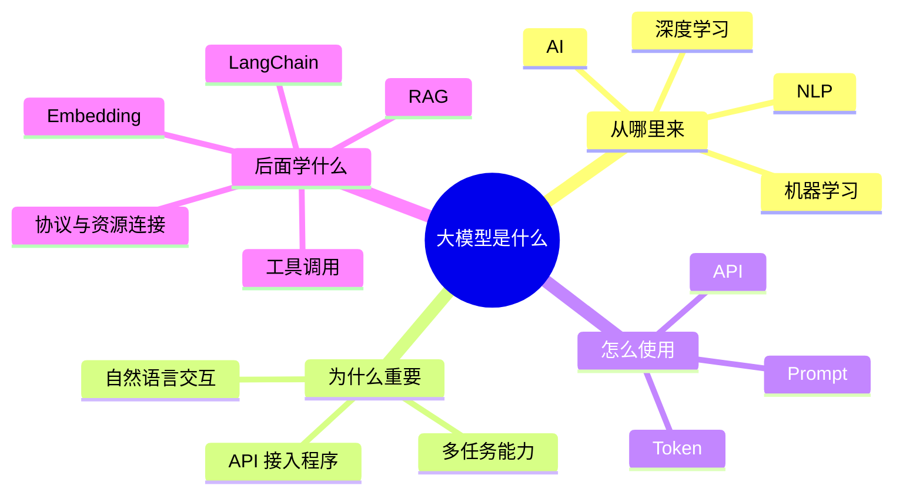

这张图就是这篇文章想先画出来的东西。

## 一个常见误解：大模型就是聊天机器人？

第一次接触大模型时，最直接的感受通常是：它很会聊天。

你输入一句话，它回你一段话。  
你让它解释概念，它能解释。  
你让它写文章，它能写。  
你让它改代码，它也能给出建议。

所以很容易把它理解成：

**一个更聪明的聊天机器人。**

这个理解不能说完全错，因为聊天确实是我们最常见的使用入口。  
但继续往下学以后会发现，这个理解太表层了。

如果只把大模型看成聊天机器人，后面很多东西就解释不通。

| 后面遇到的问题 | 如果只理解成聊天机器人，就会困惑 |
| --- | --- |
| 为什么开发者要通过 API 调用它 | 聊天框之外还有程序接入场景 |
| 为什么要研究 Token 成本 | 模型调用不是无限输入、无限免费 |
| 为什么同样的问题，不同 Prompt 效果差很多 | 自然语言输入其实是在设计任务 |
| 为什么要让模型调用工具 | 真实应用不只是回答，还要执行动作 |
| 为什么要把文档接进模型 | 模型不天然知道私有资料 |
| 为什么需要 LangChain 这类框架 | 复杂 AI 应用需要编排模型、工具、记忆和检索 |

这些问题说明，大模型真正重要的地方，不只是“能回答问题”，而是它可以变成一种系统能力。

更稳的理解是：

> 大模型不是一个单独的聊天产品，而是一种可以通过自然语言调用、也可以通过程序接入的通用语言能力接口。

这个理解很重要，因为它把“聊天框”这个表象往后推了一层。

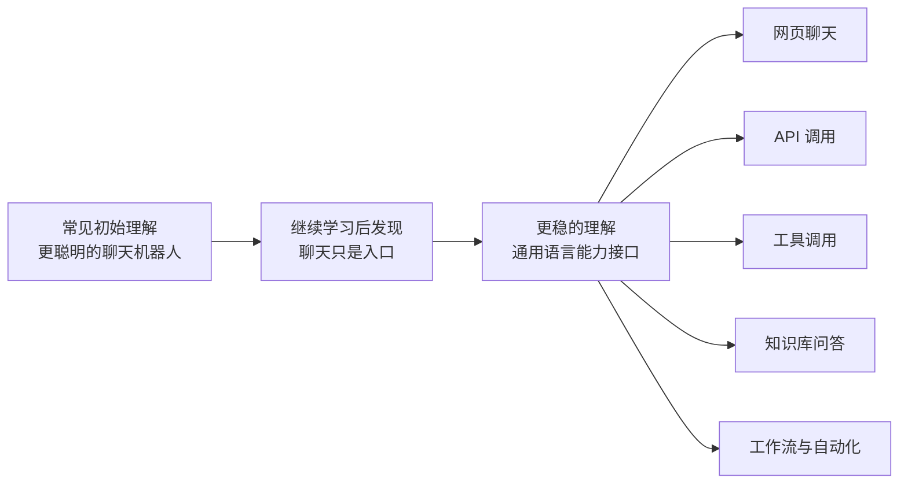

聊天只是入口。  
能力接口才是本质。

## 第一条线：AI 不是从大模型开始的

要理解大模型，不能直接从大模型讲起，而要往前退一步，从 AI 讲起。

AI，也就是人工智能，目标是让机器具备一部分人类智能能力，比如识别、判断、学习、推理、生成、理解语言。

但 AI 不是一开始就像今天这样能聊天、能写代码、能总结文档。

早期很多 AI 系统更像“规则系统”：

- 如果用户说“退款”，就转售后。
- 如果邮件标题里出现某些词，就判定为垃圾邮件。
- 如果图片里有某些特征，就归到某个类别。

这种方式本质上是：

> 人写规则，机器执行。

它适合边界清晰的问题。  
但一旦场景复杂起来，就会很吃力。

比如用户不一定会说“退款”。他可能说“这个东西我不想要了”“能不能退一下”“买错了”“我想取消订单”“不太合适，怎么处理”。

如果每一种说法都要人工写规则，系统会越来越复杂，也越来越脆弱。

于是 AI 的思路开始发生变化：不再只靠人写规则，而是让机器从数据里学习规律。

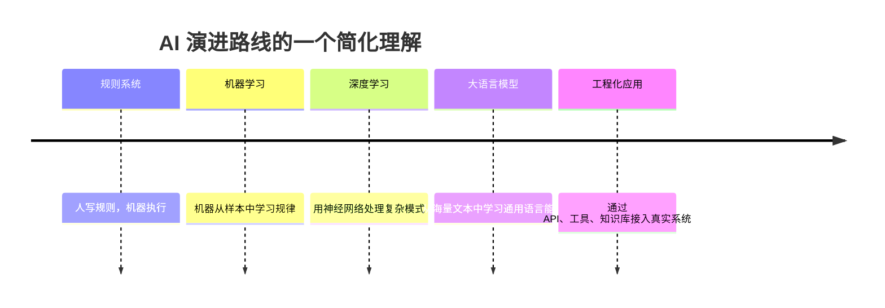

这样一看，大模型不是突然出现的“新魔法”，而是 AI 技术长期演进后的一个阶段。

这个理解能让学习路径更稳。

因为它说明，大模型不是孤立的概念。  
它前面连着机器学习、深度学习和自然语言处理，后面连着 API、工具调用和知识库应用。

## 传统 AI 像“专用工具”，大模型更像“通用能力层”

可以用一个不太严谨但好理解的比喻：

> 传统 AI 更像专用工具，大模型更像通用能力层。

| 对比维度 | 传统 AI | 大模型 |
| --- | --- | --- |
| 典型形态 | 人脸识别、垃圾邮件过滤、推荐系统、语音识别 | 问答、总结、翻译、写作、代码解释、工具调用 |
| 任务边界 | 通常比较明确 | 可以通过自然语言适配多种任务 |
| 使用方式 | 调用固定功能 | 描述意图和任务 |
| 优势 | 针对单点任务优化 | 通用性强，迁移到新任务更自然 |
| 局限 | 扩展到新任务成本高 | 可能幻觉，需要约束和校验 |

这里能看到一个明显变化：

以前使用软件，更多是在找功能按钮。  
现在使用大模型，更多是在描述任务意图。

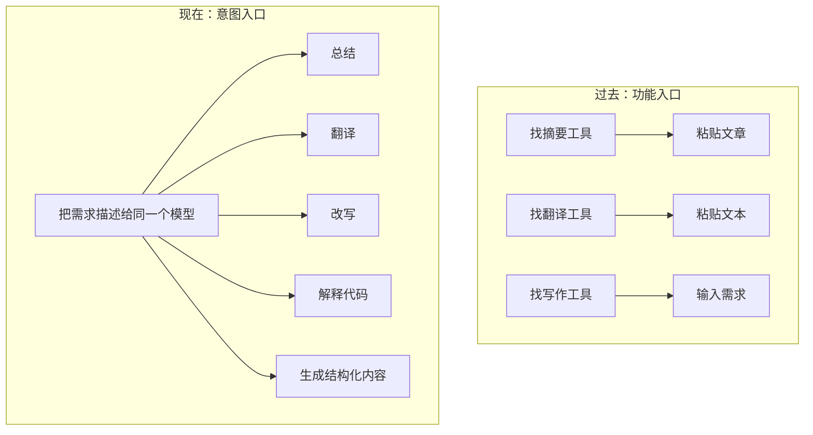

这背后的变化不是“多了一个工具”，而是交互方式变了。

**自然语言开始变成一种新的操作界面。**

这也是大模型真正值得重视的地方：它降低了人和复杂系统之间的沟通成本。

## AI、机器学习、深度学习、NLP、大模型：先这样摆位置

学到这里，最需要理顺的是几个名词之间的关系。

可以先这样摆：

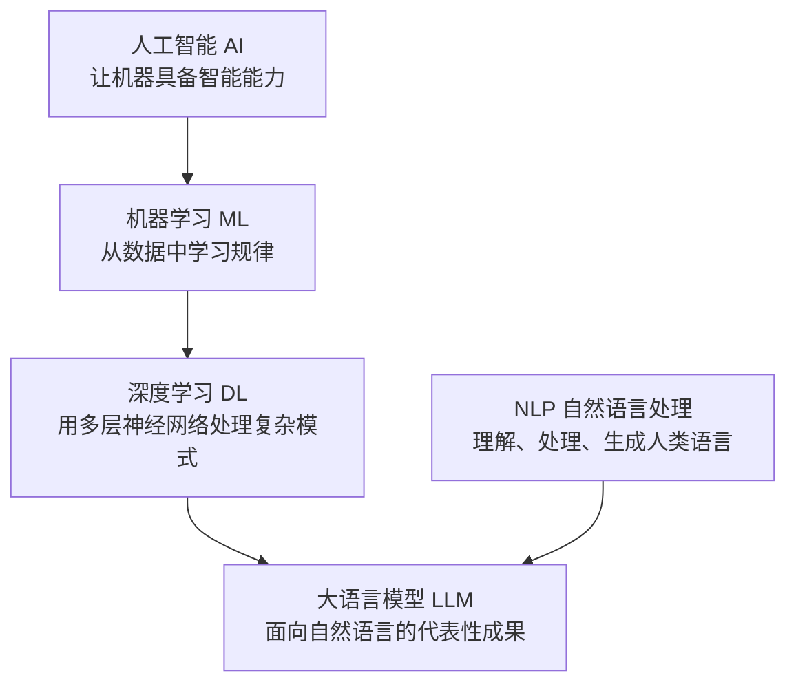

如果用一句话总结，可以这样说：

> AI 是目标，机器学习是路线，深度学习是方法，NLP 是方向，大语言模型是当前阶段非常重要的成果之一。

这句话不是为了显得严谨，而是帮助把位置摆正。

大模型不等于整个 AI。AI 还有计算机视觉、语音、机器人、推荐系统、规划决策等很多方向。

只是大模型这几年特别显眼，因为它有三个特点：

| 特点 | 为什么重要 |
| --- | --- |
| 普通人能直接感知 | 打开聊天框就能体验能力 |
| 自然语言交互门槛低 | 不懂复杂软件也能描述需求 |
| 能通过 API 工程化 | 可以接入程序、流程和业务系统 |

这也是它从技术圈迅速扩散到日常工作和学习中的原因。

## 怎么理解“大语言模型”

LLM 是 `Large Language Model`，也就是大语言模型。

如果只给入门阶段一个定义，可以这样写：

> 大语言模型是在海量文本、代码和对话等数据上训练出来的深度学习模型，它学习语言规律和上下文关系，然后根据输入生成输出。

这里面有几个点值得拆开。

### 它的能力来自训练，不是凭空来的

模型之所以能写、能总结、能翻译、能解释代码，是因为它在训练阶段接触过大量文本和代码材料。

它从里面学习：

| 学到的模式 | 举例 |
| --- | --- |
| 词和词的关系 | 哪些词经常一起出现 |
| 句子和句子的关系 | 什么样的上下文后面常接什么表达 |
| 问题和回答的关系 | 提问通常如何被回应 |
| 代码和注释的关系 | 代码逻辑如何用自然语言解释 |
| 文档和结构的关系 | 标题、段落、列表、表格如何组织 |

刚开始容易把模型的回答理解成“它知道答案”。

更谨慎的说法是：

> 它不是像人一样知道，而是在大量训练中学会了如何根据上下文生成看起来合理的回答。

这个理解能解释它为什么强，也能解释它为什么会犯错。

### 它不是数据库

这一点特别重要。

数据库是“存什么，查什么”。  
大模型不是这样。

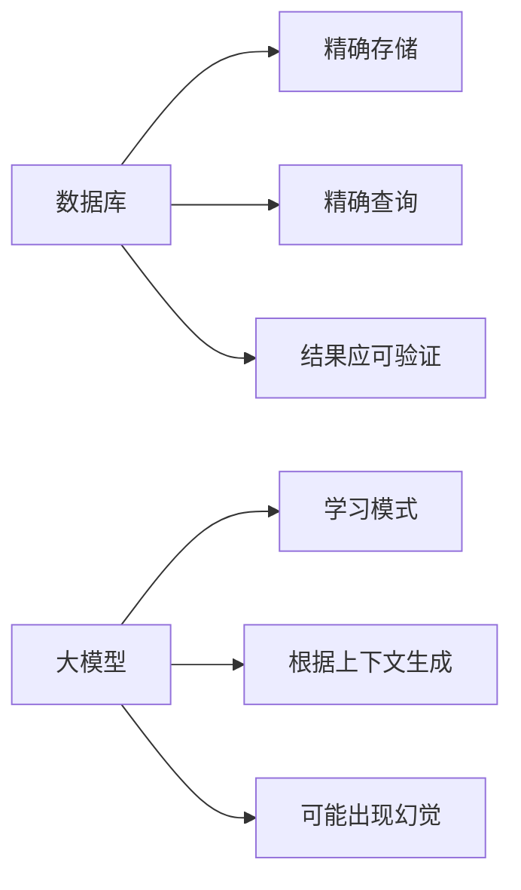

大模型更像是：根据当前输入、上下文和训练中学到的模式，生成一个最可能合适的回答。

所以它有时候会非常聪明，有时候也会一本正经地胡说。

这就是所谓“幻觉”的一个直觉来源。

它不是在做精确查询，而是在做生成。  
所以，越是事实性、专业性、高风险的信息，越不能只依赖模型本身，必须校验。

### 它可以先被看成“输入到输出”的黑盒

入门阶段，可以先把大模型想成：

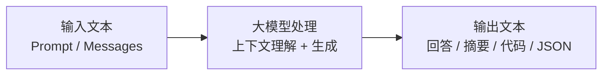

后面多模态模型会加入图片、音频、视频。

但在学习的第一阶段，先理解文本输入和文本输出就够用了。

这里有一个重要的衍生问题：

| 衍生问题 | 引出的后续概念 |
| --- | --- |
| 如果模型靠输入生成输出，那怎么控制输入？ | Prompt |
| 如果输入和输出有长度、成本限制，那怎么计量？ | Token |
| 如果想在程序里调用模型，而不是只在网页聊天，怎么办？ | API |
| 如果模型回答不够，还要操作外部系统怎么办？ | 工具调用 |
| 如果模型不知道私有资料怎么办？ | RAG / 向量检索 |

这样一连，后面的知识点就不散了。

## “大模型”的“大”，可以从四个角度理解

“大模型”的“大”不是一句口号。

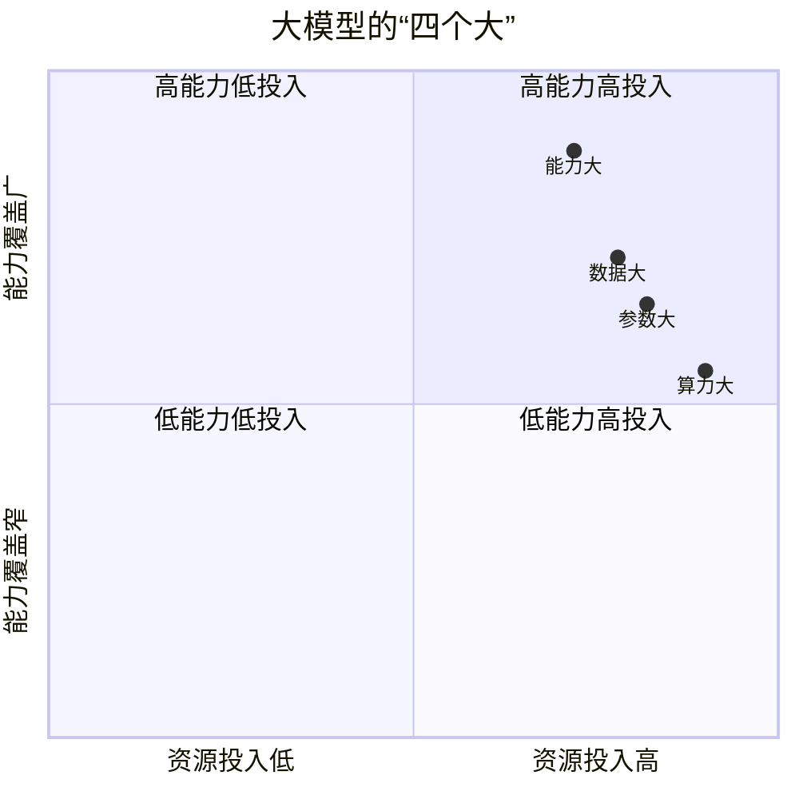

如果用更朴素的话讲：

| 维度 | 可以这样理解 | 需要注意的点 |
| --- | --- | --- |
| 数据大 | 训练时接触大量文本、代码、网页、文档、对话 | 数据质量同样重要，不是越多越好 |
| 参数大 | 模型内部有大量可学习权重 | 参数大不等于一定适合具体任务 |
| 算力大 | 训练依赖大量 GPU 和分布式计算 | API 使用者不一定需要自己买显卡 |
| 能力大 | 一个模型可以完成多类语言任务 | 能力通用不代表答案永远可靠 |

对入门阶段来说，先不必陷入“要不要买显卡”这种问题。  
如果只是调用 API，算力是在服务商那边。

真正要关心的是：任务能不能说清楚、成本能不能接受、输出能不能验证、结果能不能接入流程。

## Token：它不是一个小概念

刚开始看到 Token，很容易以为它只是一个计费单位。  
后来发现，它其实影响很多事情。

Token 可以先理解成模型处理文本时的基本单位。它不一定等于一个字，也不一定等于一个词。

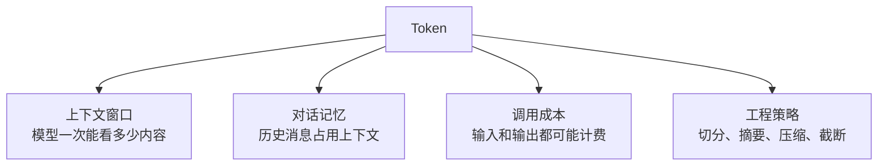

### 模型一次能看多少内容

模型有上下文窗口。所谓 8K、32K、128K 上下文，本质上是在说模型一次最多能处理多少 Token。

如果要让模型总结一份长文档，或者分析一个很长的对话记录，就必须考虑上下文窗口够不够。

### 模型能记住多少对话历史

模型并不是天然“记得”所有历史。

多轮对话时，系统通常会把前面的对话一起放进上下文发给模型。历史越长，占用 Token 越多。

超过上下文限制后，早期内容可能会被截断或压缩。

所以长对话里的“记忆”，其实是工程设计出来的，不是无限的。

### 调用模型要花多少钱

很多 API 会按输入 Token 和输出 Token 计费。

这说明：大模型工程不是只看效果，还要看成本。

一个 Prompt 写得很长，可能效果更稳，但成本也更高。多轮对话保留太多历史，体验可能更连贯，但费用也会增加。

所以 Token 后面一定要单独学。  
它是上下文、记忆和成本的共同底层单位。

## Prompt：不是“会问问题”，而是“会描述任务”

Prompt 是另一个容易被低估的东西。

刚开始很容易以为 Prompt 就是“怎么问 AI”。  
后来发现，这个理解太轻了。

Prompt 更像是任务设计。

一个好的 Prompt，通常不只是一个问题，而是一份小型任务说明书。

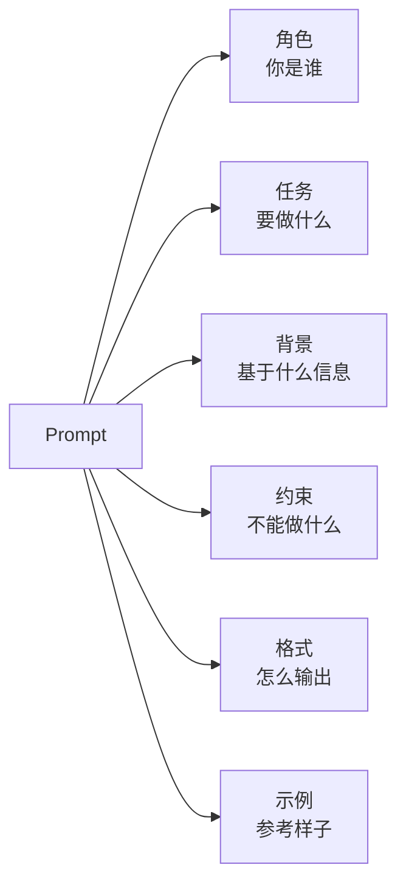

比如：

```text
帮我整理这段会议纪要。
```

这当然也能用。

但如果换成：

```markdown
你是一名项目助理，请把下面这段会议纪要整理成 5 个待办事项。

要求：
1. 每个待办事项都要包含负责人、动作和截止时间
2. 如果原文没有负责人或截止时间，标记为“待确认”
3. 最后补充一个“需要追问的信息”小结
```

模型就更容易输出符合预期的结果。

这里可以得到一个新的认识：

> Prompt 能力，本质上是把模糊想法变成清晰任务的能力。

这不仅是 AI 技巧，也是一种表达能力。

## API：从“使用 AI”到“构建 AI 应用”

如果只在网页里聊天，本质上是在使用 AI 产品。

但如果通过 API 调用模型，就开始把模型接入自己的程序。

这两者差别很大。

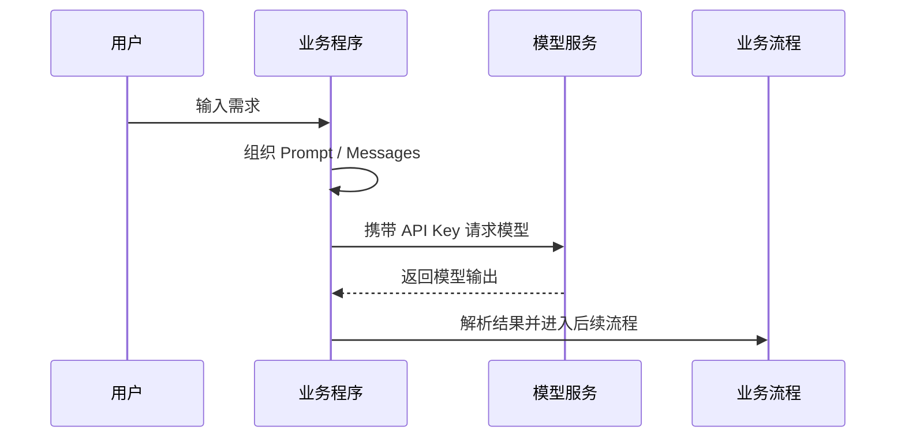

这里会出现几个基础概念：

| 概念 | 入门阶段可以这样理解 |
| --- | --- |
| API Key | 调用凭证 |
| Base URL | 接口地址 |
| Model | 模型名称 |
| Messages | 对话内容 |
| Temperature | 输出随机性 |
| Stream | 流式输出 |

理解 API 之后，大模型的工程价值会变得更具体。

它不只是一个网页工具，而是可以接入自动客服、文档问答、会议纪要、代码助手、数据分析、企业知识库、自动化工作流。

这也是为什么后面还需要继续学习 API、工具调用、协议连接和知识库。

因为真实应用里，模型不能只会说。  
它还要能接工具、读资料、调接口、参与流程。

## AIGC 和 AGI：一个是现在能用，一个是未来目标

学习大模型时，经常会遇到 AIGC 和 AGI。

刚开始也容易把它们混在一起，觉得都是“很高级的 AI”。继续拆开看，会发现它们不是一个层级。

| 概念 | 阶段性理解 | 当前状态 |
| --- | --- | --- |
| AIGC | 人工智能生成内容，比如文章、图片、音频、视频、代码 | 已经广泛落地 |
| AGI | 通用人工智能，接近人类水平的跨领域理解、学习、推理、计划和决策 | 仍是长期目标 |

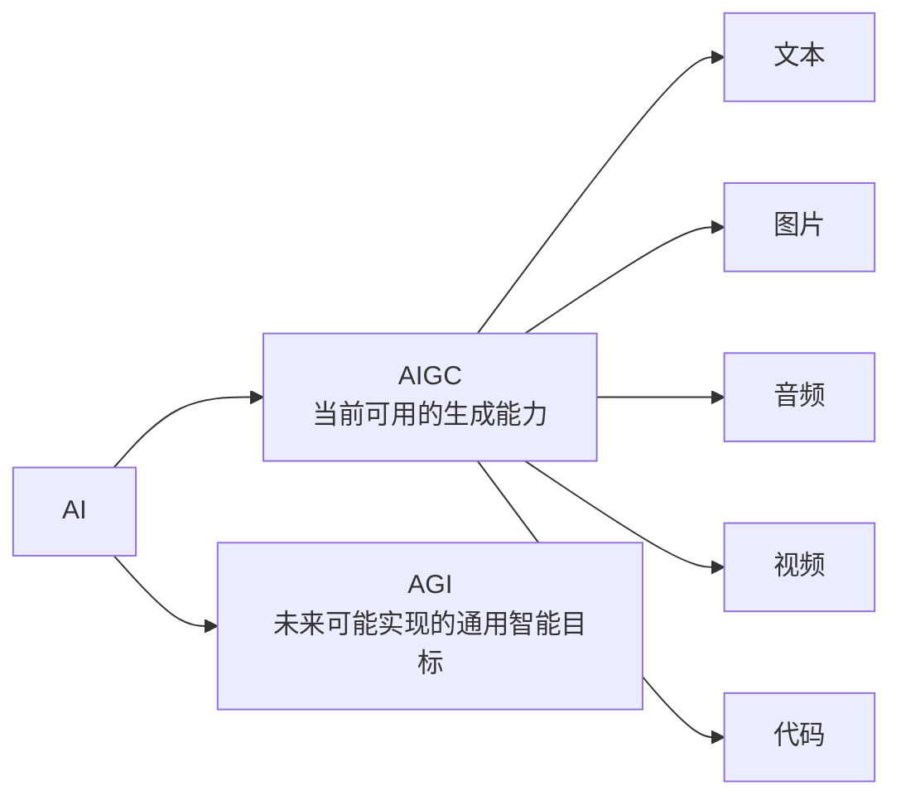

大模型推动了 AIGC 的爆发，但大模型不等于 AGI。

这个区分能避免两种误解：

- 过度神化：觉得大模型已经无所不能。
- 过度轻视：觉得它只是自动补全文字。

更合适的态度是：承认它现在已经很有用，同时也知道它还有边界。

## 大模型适合做什么？先按任务形态来理解

判断一个任务适不适合大模型，可以先问：

> 这个任务能不能表达成文本输入和文本输出？

如果能，大模型大概率有参与空间。

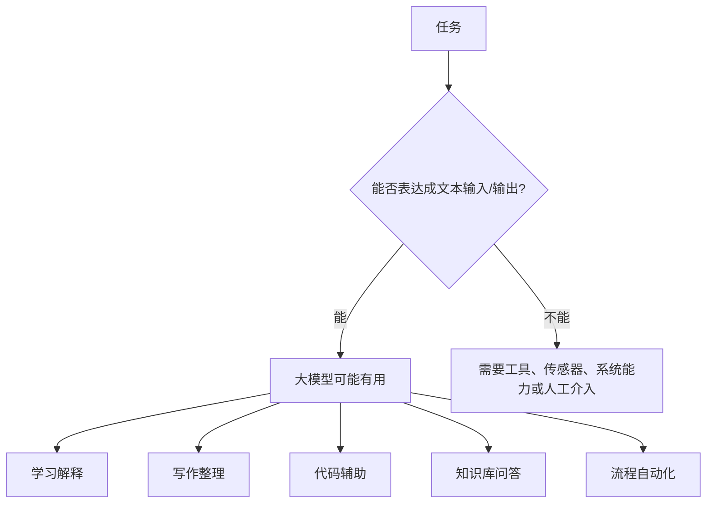

| 场景 | 适合做什么 | 定位 |
| --- | --- | --- |
| 学习 | 解释概念、总结知识点、生成练习题、对比技术 | 学习搭子 |
| 写作 | 写大纲、改标题、润色表达、整理思路 | 把想法摊开的人 |
| 编程 | 解释报错、生成示例、写测试思路、生成 SQL 草稿 | 减少卡住时间 |
| 企业知识 | 客服问答、知识库、文档检索、会议纪要 | 需要结合 RAG 和工具 |

但不适合把它当成代写工具，也不适合把它当成万能顾问。

它能帮助人更快进入问题，但最后哪些表达留下、哪些方案可用，仍然需要人的判断。

## 大模型不适合做什么？边界同样重要

理解大模型时，不能只写它能做什么，也要写它不能直接做什么。

| 边界 | 为什么要注意 | 应对方式 |
| --- | --- | --- |
| 不适合当作事实源 | 模型可能幻觉，把不存在的东西说得很像真的 | 重要事实必须查证 |
| 不天然知道私有资料 | 它不会自动知道公司文档、项目资料、个人笔记 | 用 RAG、知识库或工具能力接入 |
| 不保证代码一次正确 | 生成的代码可能有 bug 或不符合环境 | 必须运行、测试、对照文档 |
| 不是免费资源 | 上下文越长、调用越多、模型越强，成本越高 | 做 Token 管理和成本控制 |

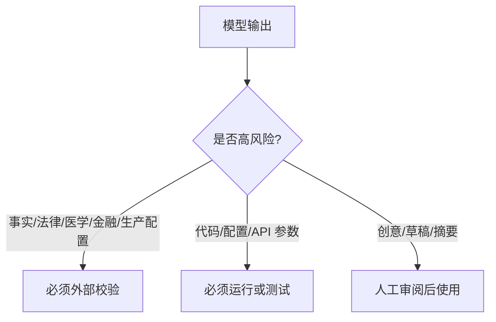

把模型输出当草稿，会很有帮助。  
把模型输出当最终答案，就容易出问题。

## 为什么大模型这几年突然爆发？关键是几件事凑齐了

相比简单说“大模型突然火了”，更值得关注的是背后的条件。

这会让人感觉它像一个偶然事件。

更稳的理解是：几个条件同时成熟了。

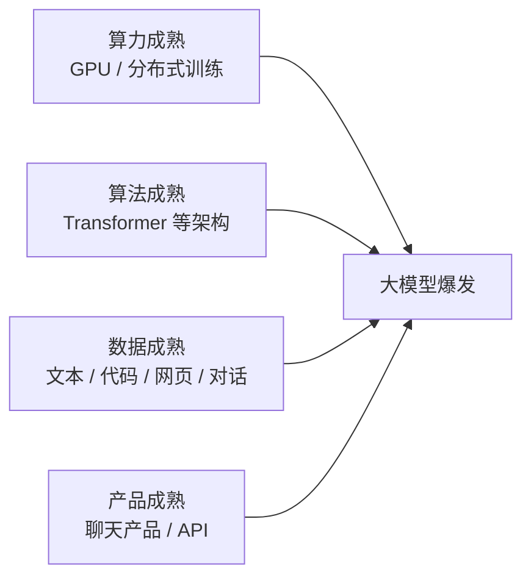

这四件事叠加在一起，才让大模型从实验室能力变成日常工具和工程能力。

所以它不是一夜之间突然变聪明。  
它更像是长期积累后，到达了一个普通人也能明显感知的临界点。

## 这一篇真正要立住的理解

写到这里，对大模型的理解可以从“聊天机器人”往后走一层。

可以这样定义它：

> 大模型是一种在海量数据上训练出来、以自然语言为主要交互方式、能够完成多种知识和语言任务，并可以通过 API、工具调用和知识库接入工程系统的通用能力接口。

这句话里有几个关键点：

| 关键词 | 说明 |
| --- | --- |
| 海量数据 | 说明它的能力来源 |
| 自然语言 | 说明它为什么好用 |
| 多种任务 | 说明它为什么通用 |
| API 和工具调用 | 说明它为什么能工程化 |
| 知识库 | 说明它如何连接私有资料 |

它不是全部答案，但足够作为入门阶段的第一张地图。

## 下一篇怎么接

这一篇解决的是“如何理解大模型”。

后面可以沿着这条路线继续展开：

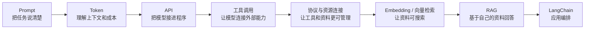

下一篇进入 Prompt。

因为如果大模型的入口是自然语言，那第一个真正需要练的能力，就是：

**如何把任务说清楚。**

## 小结：这篇先把地图画出来

这一篇不是为了把所有概念讲完。

它更像是先把地图画出来：

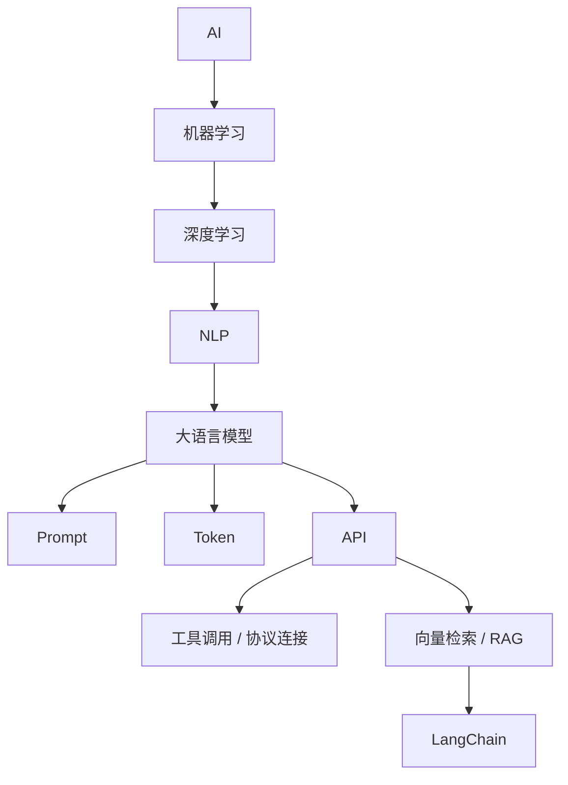

有了这张地图，后面再学新概念时，至少知道它大概该放在哪里。

这才是学习大模型真正的开始。
