# 大模型学习笔记 03：大模型是怎么生成回答的

> 这是我继续学习大模型时整理的第三篇。  
> 前两篇主要解决了两个问题：大模型大概是什么，以及 Prompt 为什么不是随口提问，而是任务设计。  
> 这一篇继续往模型内部推进一点：当我们输入一句话以后，大模型到底是怎么一步步生成回答的？

## 这篇主要整理了哪些学习点

这篇文章不会深入推导 Transformer 的数学细节。  
更重要的是先建立一个能支撑后续学习的直觉：

**大模型不是在数据库里“查答案”，而是在上下文里不断预测下一个更可能出现的 Token。**

| 类型 | 学习点 | 在这篇里的处理方式 |
| --- | --- | --- |
| 重点整理 | LLM、GPT、ChatGPT 的关系 | 先把模型、模型系列、产品入口分清楚 |
| 重点整理 | 大模型为什么不是数据库 | 从“查找答案”和“生成答案”的差别讲起 |
| 重点整理 | 文本为什么要分词 | 解释自然语言进入模型前要变成可处理的单位 |
| 重点整理 | 下一个 Token 预测 | 用一个迷你语言模型理解生成过程 |
| 重点整理 | 上下文如何影响回答 | 解释 Prompt、历史对话、资料都会改变后续预测 |
| 重点整理 | 幻觉从哪里来 | 从概率生成、知识缺口、上下文误导和表达自信四个角度理解 |
| 方法整理 | 怎样更稳地使用模型 | 给出提问、校验、引用资料、拆任务的实用原则 |
| 边界意识 | 哪些场景必须人工复核 | 归纳高风险场景，不把模型输出直接当最终事实 |

如果说第二篇讲的是“怎么把任务说清楚”，那这一篇讲的是：

**为什么同样是输入文字，大模型不是简单返回固定答案，而是在动态生成一个回答。**

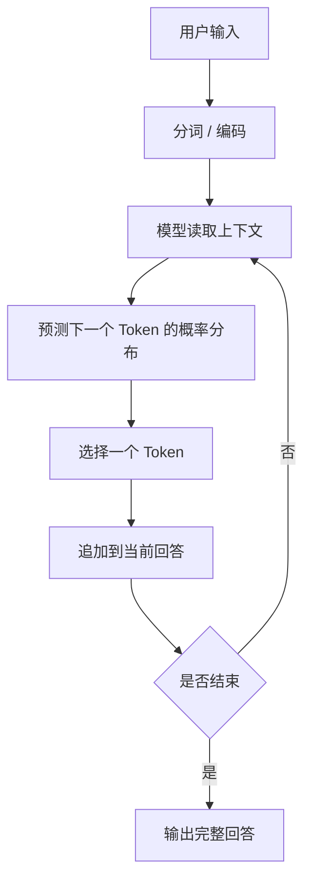

这张图先放在这里。  
它是理解大模型生成回答时最重要的一张底图。

## 一个常见误解：模型是不是在“查资料”？

刚开始用大模型时，很多人会很自然地把它理解成一个超级搜索引擎。

比如问：

```text
什么是 HTTP 缓存？
```

它回答一大段。

再问：

```text
Redis 为什么快？
```

它又回答一大段。

这种体验太像“问一个很大的知识库”了，所以很容易产生一个直觉：

> 模型内部是不是存了很多资料？  
> 提问时，它是不是把相关资料查出来，然后整理成回答？

这个理解有一部分直觉是对的：大模型确实在训练阶段见过大量文本，也确实从这些文本里学到了很多语言模式和知识关联。  
但如果把它完全理解成“查资料”，后面很多现象就解释不通。

比如：

| 现象 | 如果把模型当数据库，会很困惑 |
| --- | --- |
| 同一个问题，多问几次回答可能不完全一样 | 数据库查询通常应该稳定返回同一条记录 |
| 模型会编出听起来很像真的内容 | 数据库查不到一般应该返回空，而不是继续编 |
| Prompt 换一种写法，回答重点会变化 | 数据库查询不应该这么依赖措辞 |
| 模型能模仿不同语气和格式 | 数据库主要负责存取，不负责表达风格 |
| 模型能写从未存在过的新文本 | 查资料只能返回已有内容，生成可以组合出新内容 |

更稳的区分方式是：

| 类比对象 | 核心动作 | 结果特点 |
| --- | --- | --- |
| 数据库 | 查找、过滤、返回记录 | 稳定、精确、依赖已有数据 |
| 搜索引擎 | 检索网页、排序、展示链接或摘要 | 依赖索引和网页来源 |
| 大语言模型 | 根据上下文预测并生成文本 | 灵活、会表达、也可能出错 |

这不是说大模型没有知识。  
更准确地说，它拥有的不是一条条可直接定位的数据库记录，而是从大量文本中学到的参数化模式。

可以用一个不太严谨但好理解的类比：

> 数据库像仓库，问题来了就去货架上找东西。  
> 大模型更像一个语言生成系统，它根据当前上下文判断“接下来怎么说最合理”。

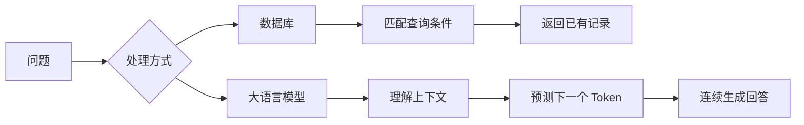

这个区别非常重要。  
因为只要把模型当成数据库，就会对它产生错误期待：希望它每句话都像数据库记录一样可靠。  
但它的工作方式不是这样。

## 先分清三个词：LLM、GPT、ChatGPT

在继续讲生成过程之前，有必要先把几个经常混用的词分开。

### LLM：大语言模型

LLM 是 Large Language Model，也就是大语言模型。

它的“大”可以从几个方面理解：

| 维度 | 含义 |
| --- | --- |
| 数据大 | 训练时看过海量文本、代码、网页、书籍、对话等内容 |
| 参数大 | 模型内部有大量可学习参数，用来表示语言和知识模式 |
| 算力大 | 训练和推理都需要大量计算资源 |
| 能力覆盖面大 | 能写作、翻译、总结、问答、代码、推理、分类等 |

从使用者角度看，它最直观的形态是：

```text
输入一段文字 -> 输出一段文字
```

但这只是外在形式。  
内部真正发生的是一系列分词、编码、注意力计算、概率预测和解码生成。

### GPT：一类生成式预训练模型

GPT 可以拆成三个关键词：

| 词 | 可以这样理解 |
| --- | --- |
| Generative | 生成式，能继续生成文本 |
| Pre-trained | 预训练，先在大量数据上学习通用语言模式 |
| Transformer | 基于 Transformer 架构，擅长处理序列和上下文关系 |

所以 GPT 不是聊天框本身，而是一类模型能力。

### ChatGPT：面向对话的产品形态

ChatGPT 则更像是把底层模型包装成了一个可对话的产品。

它不只是模型本身，还包括：

- 对话界面
- 消息历史管理
- 安全策略
- 系统提示词
- 工具能力
- 文件、图片、代码等交互入口

可以这样理解：

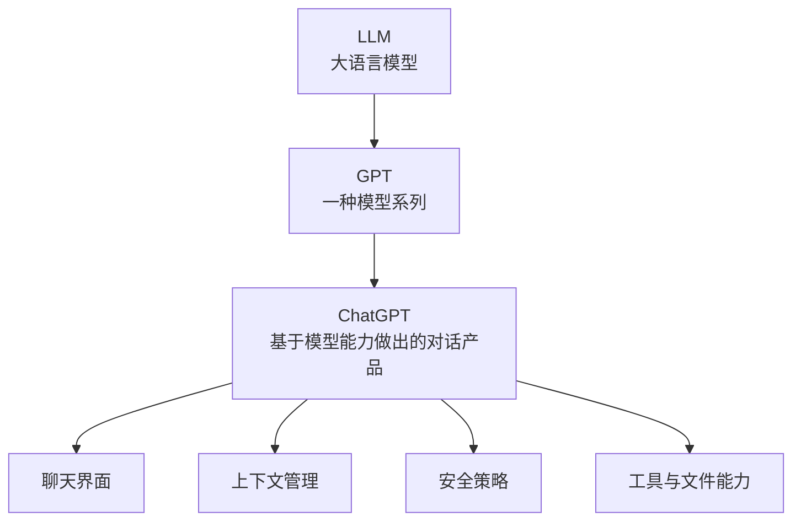

这个区分很重要。  
因为后面讨论“模型怎么生成回答”时，主要讨论的是底层语言模型的生成机制，而不是某个具体聊天产品的所有功能。

## 文本进入模型之前，先要变成 Token

人看到一句话，会直接理解意思。

但模型不能直接“看懂”汉字或英文单词。  
模型需要先把文本拆成一个个更小的单位，再转成数字表示，才能进入计算过程。

这个单位通常叫 `Token`。

Token 可以粗略理解成模型处理文本时的基本片段。  
它不一定等于一个汉字，也不一定等于一个英文单词。不同模型的分词器不一样，切分结果也会不同。

举个直观例子：

| 原始文本 | 人的直觉切分 | 模型可能的 Token 化直觉 |
| --- | --- | --- |
| 订单接口为什么变慢 | 订单 / 接口 / 为什么 / 变慢 | 可能接近词，也可能拆成更细片段 |
| cache miss | cache / miss | 英文常见词可能作为独立片段 |
| OpenAI API | OpenAI / API | 专有名词可能被拆成一个或多个片段 |
| 2026-08-27 | 日期整体 | 可能拆成数字、符号、子片段 |

这也是为什么 Token 不能简单等同于“字数”。  
同样一句话，不同语言、不同符号、不同模型分词器，都会影响最终 Token 数。

为了先建立直觉，可以把它简化理解成：

```text
一句话 -> 一串 Token -> 一串数字 -> 模型计算
```


这里先不展开 Token 的成本和上下文长度，因为那会放到后面的专门文章里。  
这一篇先抓住一个关键点：

> 模型不是直接处理“完整句子”，而是处理 Token 序列。

这件事会影响很多后续问题：

- 为什么长文本会有上下文限制
- 为什么输入越长成本越高
- 为什么不同语言的 Token 消耗不同
- 为什么模型是一个字一个字或一段一段生成出来的
- 为什么输出可以中途停止

## 一个迷你语言模型：先从“下一个词预测”理解

真正的大模型很复杂。  
如果一开始就讲 Transformer、Attention、Embedding、LayerNorm、Softmax，很容易被细节绕进去。

更适合入门的方式，是先看一个极简模型：

> 给它几句话，让它统计“某个词后面最常出现什么词”，再根据统计结果补全句子。

这当然不是真正的大模型，但它能帮助我们理解一个核心思想：

**生成文本可以被看成不断选择下一个更可能出现的词。**

### 准备一小段语料

假设有几条工作记录：

```text
接口 响应 变慢 需要 排查
数据库 查询 变慢 需要 优化
接口 超时 需要 限流
缓存 命中 下降 需要 排查
排查 需要 查看 日志
优化 需要 增加 索引
```

为了让例子更直观，下面先使用已经切好词的句子。

### 统计相邻词

接下来统计每个词后面跟过哪些词。

比如：

| 当前词 | 后面出现过的词 |
| --- | --- |
| 接口 | 响应、超时 |
| 响应 | 变慢 |
| 变慢 | 需要 |
| 需要 | 排查、优化、限流、查看、增加 |
| 排查 | 需要 |
| 数据库 | 查询 |

如果再统计次数，就可以得到一个很简单的概率表。

| 当前词 | 下一个词 | 出现次数 | 概率直觉 |
| --- | --- | --- | --- |
| 接口 | 响应 | 1 | 50% |
| 接口 | 超时 | 1 | 50% |
| 变慢 | 需要 | 2 | 100% |
| 排查 | 需要 | 1 | 100% |
| 优化 | 需要 | 1 | 100% |

这里的“概率”可以用一个最简单的条件概率表示：

```text
P(下一个词 | 当前词) = 当前词后面接某个词的次数 / 当前词后面出现过的所有次数
```

其中：

- `P(下一个词 | 当前词)` 表示：已经看到当前词以后，下一个词是某个候选词的概率。
- 分子是“当前词 -> 某个下一个词”出现了多少次。
- 分母是“当前词后面所有下一个词”一共出现了多少次。

比如在上面的语料里，`接口` 后面出现过两次：

```text
接口 -> 响应：1 次
接口 -> 超时：1 次
```

所以：

```text
P(响应 | 接口) = 1 / 2 = 50%
P(超时 | 接口) = 1 / 2 = 50%
```

再看 `变慢`：

```text
接口 响应 变慢 需要 排查
数据库 查询 变慢 需要 优化
```

`变慢` 后面两次都是 `需要`，所以：

```text
P(需要 | 变慢) = 2 / 2 = 100%
```

这就是一个非常简陋的语言模型。

它没有真正理解“接口”“数据库”“优化”这些词的含义。  
它只是知道，在这批语料里，某些词经常挨在一起。

### 用概率补全一句话

如果给它一个起始词：

```text
数据库
```

它可能会按这个路径生成：


最后得到：

```text
数据库查询变慢需要优化需要增加索引
```

这个句子有点怪，因为它只是机械地按局部概率往下接。  
但它已经体现了生成式语言模型最基础的味道：

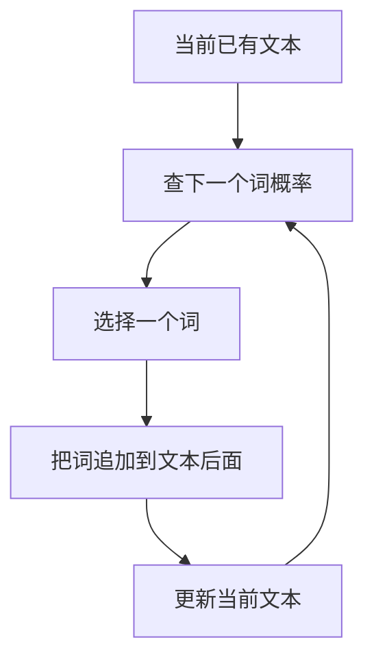

当然，真正的大模型不会只看“前一个词”。  
它会看更长的上下文，会使用深层神经网络，会把词映射成向量，会通过注意力机制判断哪些上下文更重要。

入门阶段先抓住这个简化版，就能理解生成过程的主线：

> 大模型生成回答，不是一次性吐出整篇答案，而是一步步生成下一个 Token。

## 真正的大模型比这个迷你模型强在哪里

上面的例子太简单了。  
它只统计相邻词，像一个二元语言模型。

真正的大模型强得多，至少强在这几个方面：

| 对比项 | 迷你相邻词模型 | 真正的大语言模型 |
| --- | --- | --- |
| 看上下文的范围 | 主要看当前词或前一个词 | 可以看很长的上下文 |
| 表示方式 | 词就是离散文本 | Token 会变成高维向量 |
| 学到的关系 | 相邻词频率 | 语义、语法、风格、任务模式、世界知识关联 |
| 生成方式 | 选概率最高的下一个词 | 根据概率分布和解码策略生成 |
| 泛化能力 | 很弱，只能复用小语料模式 | 可以处理没见过的组合和新任务 |
| 表达能力 | 容易机械重复 | 能生成结构化、连贯、有风格的内容 |

这里可以得到一个很重要的认识：

> “预测下一个 Token”听起来很简单，但当模型足够大、数据足够多、上下文足够长时，它表现出来的能力会非常复杂。

就像“像素点发光”听起来也很简单，但足够多的像素点组合起来，就能显示电影。  
单个动作很小，系统规模上来以后，能力会发生质变。

### Transformer 和注意力机制先怎么理解

这里不急着深入公式，可以先建立一个直觉：

Transformer 让模型在处理当前 Token 时，不只盯着旁边一个词，而是能参考上下文里的很多位置。

比如这句话：

```text
用户反馈订单详情页加载很慢，排查后发现新版本多查了一张扩展表。
```

如果模型要解释“慢”的原因，它不能只看“很慢”这两个字。  
它需要关联后面的“新版本”“多查了一张扩展表”。

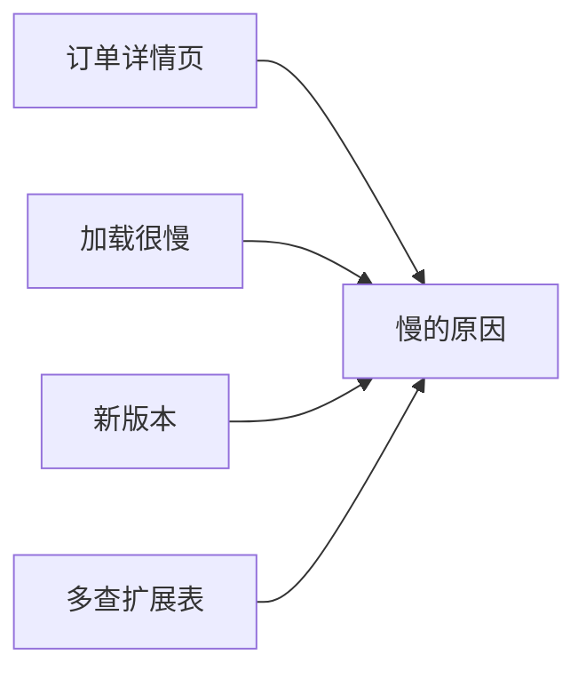

注意力机制可以先粗略理解成：

> 模型在生成某个位置时，会给上下文中不同位置分配不同的重要程度。

这也是为什么上下文写得清楚很重要。  
模型生成不是凭空发生的，它一直在利用当前能看到的上下文。

## 回答是怎样一步步长出来的

很多人一开始会以为模型回答问题，是先在内部想好完整答案，然后一次性发出来。  
更接近生成过程的理解是：

> 模型是在已有上下文基础上，逐步预测下一个 Token，回答是一点点长出来的。

假设用户问：

```text
为什么接口会变慢？
```

模型可能不是直接“取出答案”，而是在不断做类似这样的选择：

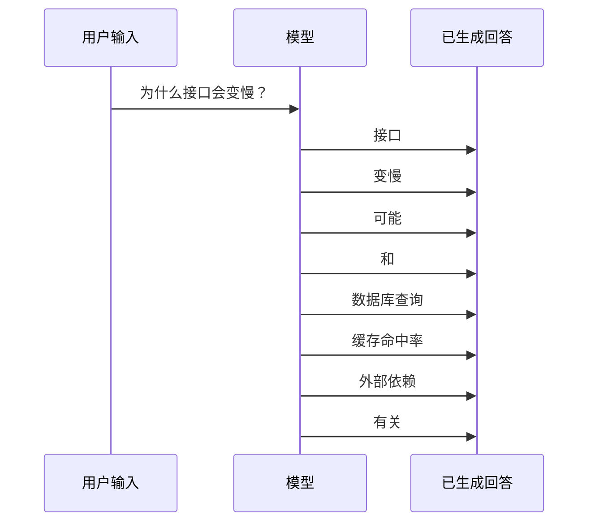

每生成一个 Token，它都会把这个 Token 放回上下文里，再继续预测下一个。

这就解释了几个现象。

### 为什么回答会有连贯性

因为模型每一步都能看到前面已经生成的内容。  
它不是每个字都孤立生成，而是在当前上下文基础上继续写。

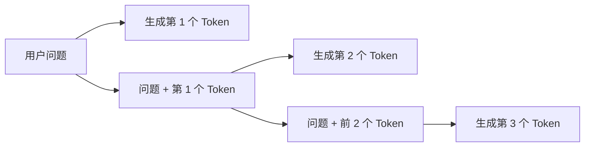

### 为什么开头会影响后面

模型一旦用了某种开头，后面就会沿着这个方向继续走。

比如同一个问题：

```text
解释一下缓存穿透。
```

如果开头是：

```text
缓存穿透是指...
```

它可能会走概念解释路线。

如果开头是：

```text
我们可以先看一个接口查询商品详情的例子...
```

它可能会走案例讲解路线。

如果开头是：

```text
从排查线上问题的角度看...
```

它可能会走工程实践路线。

这也是为什么 Prompt 里的角色、场景、输出结构很重要。  
它们会影响模型一开始往哪个方向生成。

## 生成不是只选“概率最高”的词

在迷你模型里，每次都选择概率最高的下一个词。  
这种方法叫贪心选择，直觉上最简单。

但真正的大模型生成时，不一定永远只选最高概率的那个 Token。  
如果每次都选最可能的词，回答可能会太死板、太模板化。  
如果随机性太高，回答又可能发散甚至跑偏。

所以模型生成通常会受到解码策略和参数影响。

| 方式 | 直觉理解 | 可能效果 |
| --- | --- | --- |
| 总选最高概率 | 每一步都选最稳的词 | 稳定，但可能死板 |
| 带一点随机性 | 在高概率候选里选择 | 更自然，有变化 |
| 随机性太高 | 低概率词也可能被选中 | 发散，可能不可靠 |
| 限制候选范围 | 只在较可信的候选里选 | 平衡稳定与多样性 |

这和第二篇里提到的 `temperature` 就能接上。

还是用“接口变慢”的例子。  
假设模型此刻要生成“可能原因”后面的下一个 Token，候选概率大致是：

| 候选方向 | 概率直觉 | 低随机性时 | 高随机性时 |
| --- | --- | --- | --- |
| 数据库查询 | 45% | 很可能被选中 | 仍可能被选中 |
| 缓存命中 | 25% | 有机会，但不如数据库稳定 | 更可能被尝试 |
| 外部接口 | 15% | 较少被选中 | 可能被带出来 |
| 网络抖动 | 10% | 较少被选中 | 可能被带出来 |
| 硬件故障 | 5% | 基本不会选 | 随机性过高时可能出现 |

这能解释一个实际体验：  
同一个问题，低随机性时回答更像“稳妥排查清单”；高随机性时回答可能更有启发，但也更需要人工筛选。

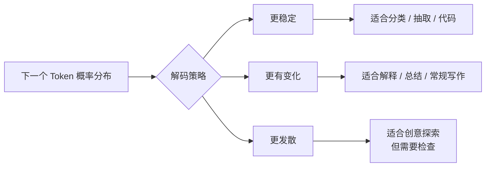

可以这样理解：

> Prompt 决定任务方向，模型参数影响生成风格，模型能力决定上限。

这三者不是互相替代的关系。

## 上下文为什么这么重要

大模型生成时不是只看当前问题，还会看它能看到的上下文。

上下文可能包括：

- 系统规则
- 用户当前问题
- 历史对话
- 粘贴进去的资料
- 工具返回的信息
- 已经生成出来的回答前文

这些内容都会影响后续 Token 的概率分布。

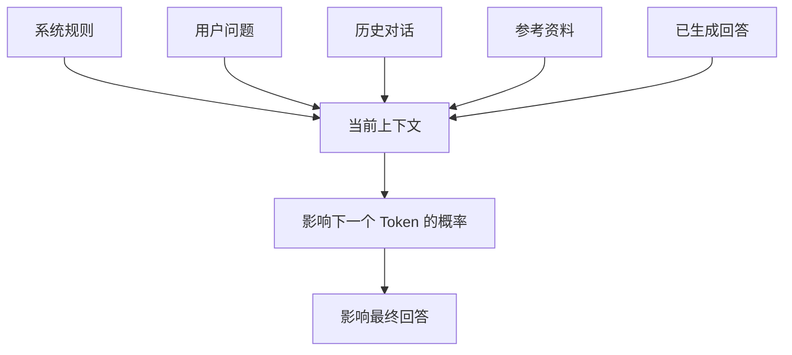

这也解释了为什么第二篇一直强调 Prompt。

如果给出的上下文是：

```text
请用一句话解释缓存。
```

模型会生成很短的答案。

如果给出的上下文是：

```text
我是后端开发，正在排查接口性能问题。
请从“减少数据库压力”的角度解释缓存，并举一个订单详情接口的例子。
```

模型就会朝工程排查方向生成。

模型不是不知道别的角度，而是当前上下文把它引到了这个方向。

## 幻觉从哪里来

理解了“生成”以后，幻觉这件事就更容易解释。

幻觉不是简单的“模型坏了”。  
很多时候它是生成机制带来的自然风险。

可以先从四个角度理解它。

### 1. 模型是在生成最像答案的文本，不是在保证事实

模型训练的核心目标之一，是让输出在语言上合理、连贯、符合上下文。  
这不等于每个事实都被实时验证过。

所以当它遇到知识缺口时，可能仍然会生成一段看起来很像答案的文本。

| 情况 | 模型可能的表现 |
| --- | --- |
| 知道答案 | 给出相对靠谱的解释 |
| 不确定 | 可能用模糊表达糊过去 |
| 不知道但上下文暗示强 | 可能顺着上下文编一个 |
| 问题本身有错误前提 | 可能默认前提成立再继续回答 |

### 2. 训练知识不是实时数据库

模型训练完成以后，它内部参数不会自动同步最新事实。  
如果没有联网、检索或工具能力，它并不天然知道最新新闻、实时价格、公司当前负责人、接口当前状态。

所以类似问题就容易出错：

- 最新版本是多少
- 今天某个比赛谁赢了
- 某个库现在的 API 有没有变化
- 某家公司当前 CEO 是谁
- 某个政策最近是否更新

这类问题不能只靠模型记忆。

### 3. 上下文可能误导模型

如果给模型一段错误资料，它可能基于错误资料继续生成。

比如：

```text
已知 Redis 是一种关系型数据库，请解释它为什么适合做缓存。
```

如果模型没有主动纠正前提，就可能顺着“关系型数据库”这个错误说下去。

所以 Prompt 不只是要清楚，还要尽量避免把错误前提塞进去。

### 4. 语言流畅会掩盖不确定性

大模型最迷惑人的地方之一是：  
它即使不确定，也可能说得很顺。

人类读者很容易把“表达流畅”误判成“内容可靠”。

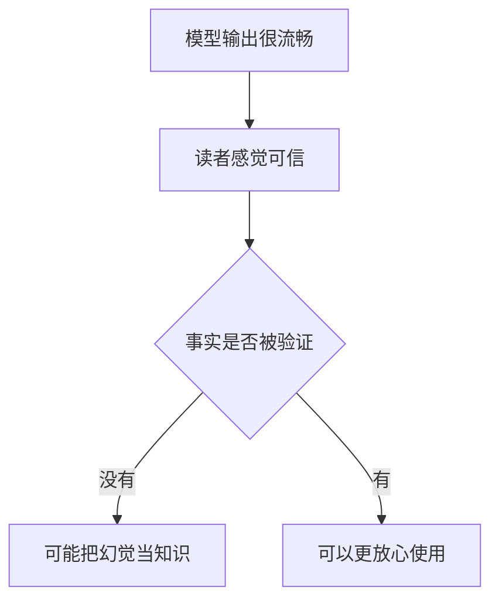

这个提醒很重要：

> 大模型回答得像真的，不等于它就是真的。

## 幻觉不是只能避免，也要学会管理

这里也要避免一种极端说法：  
“模型会幻觉，所以它不可靠，不能用。”

这句话只说对了一半。

更现实的态度应该是：

> 模型会幻觉，所以使用时要设计校验方式和应用边界。

不同任务对幻觉的容忍度是不一样的。

| 任务类型 | 幻觉风险 | 使用策略 |
| --- | --- | --- |
| 头脑风暴 | 可接受 | 重点看启发，不直接当事实 |
| 文案初稿 | 可接受 | 人工改写和判断 |
| 技术概念解释 | 中等 | 对关键点查资料确认 |
| 代码生成 | 中等偏高 | 必须运行、测试、审查 |
| 文档问答 | 较高 | 最好基于原文引用和检索 |
| 法律、医疗、金融建议 | 很高 | 只能辅助理解，不能替代专业判断 |
| 线上操作、数据修改 | 很高 | 必须加权限、校验和确认 |

这张表想说明的是：

不是所有场景都要求模型完全不出错。  
关键是要知道哪些场景可以容错，哪些场景必须谨慎。

## 怎么让回答更可靠

既然大模型是生成式的，就不能只问“它会不会错”，还要问：

**怎样让它更不容易错？**

可以从几个方向入手。

### 1. 给清楚上下文，不让模型瞎猜

模糊问题更容易得到泛泛回答。

```text
帮我分析接口慢的原因。
```

比不上：

```text
下面是接口监控和排查记录。
请只基于这些记录分析可能原因，不要补充记录外事实。
如果信息不足，请列出还需要确认的数据。
```

这个差别不是礼貌程度，而是任务边界。

### 2. 要求区分事实、推测和建议

一个很实用的方法，是让模型把不同层次分开：

```text
请把回答分成三部分：
1. 已知事实：只写资料中明确出现的信息。
2. 可能推测：基于事实可以合理推断，但还需要确认的信息。
3. 后续建议：下一步应该检查什么。
```

这样做的好处是，模型不会把所有内容混成一种“确定口吻”。

| 输出层次 | 可信度 | 使用方式 |
| --- | --- | --- |
| 已知事实 | 相对高 | 对照原资料确认 |
| 可能推测 | 中等 | 当作排查方向 |
| 后续建议 | 取决于场景 | 结合经验筛选 |

### 3. 对关键事实要求引用来源

如果让模型基于一段资料回答，可以要求它指出依据来自哪里。

```text
回答每个结论时，请引用对应的原文句子或段落编号。
如果资料里没有依据，请回答“资料中未提到”。
```

这对减少幻觉很有帮助。

模型不是不能总结，但总结应该有依据。  
尤其是做文档问答、会议纪要、需求整理时，最好让它把“依据”带出来。

### 4. 让模型承认不知道

有时候 Prompt 里要明确允许模型说不知道。

```text
如果无法从资料中判断，请直接回答“无法判断”，不要猜测。
```

这句话很简单，但很重要。  
因为默认情况下，模型往往更倾向于给出一个完整回答，而不是停下来拒绝猜。

### 5. 高风险场景必须人工校验

再好的 Prompt 也不能替代校验。

比如：

- 代码要运行测试
- SQL 要检查执行计划
- 法律条款要看原文
- 医疗建议要问医生
- 财务数据要核对系统
- 生产操作要有审批和回滚

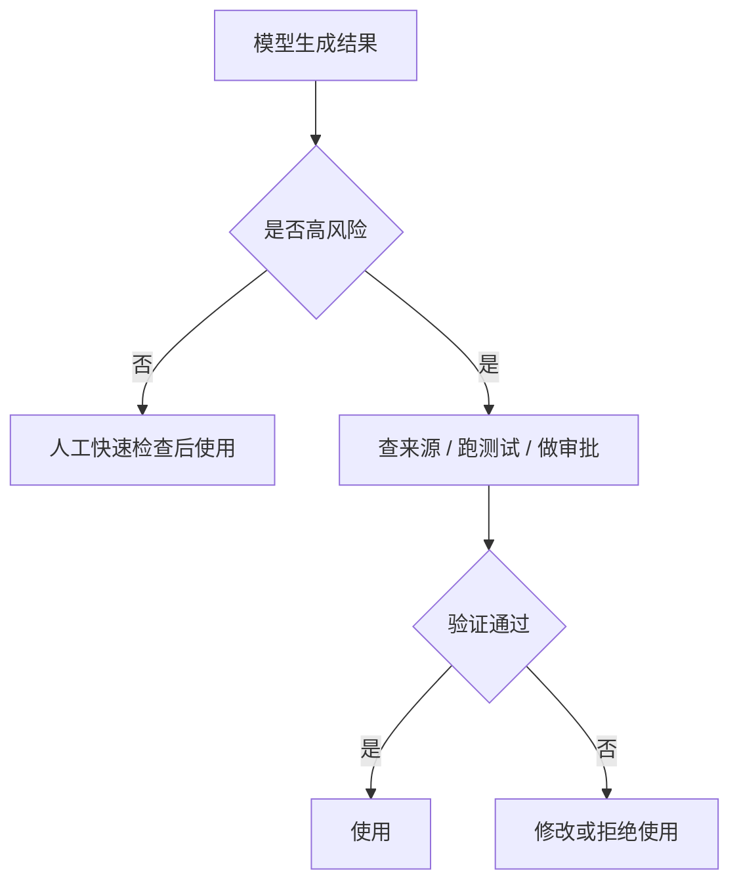

阶段性结论是：

> 模型输出可以提高效率，但不能自动获得最终可信度。  
> 可信度来自任务边界、来源依据、验证流程和人的判断。

## 一个更贴近日常使用的例子

假设现在有一段排查记录：

```text
10:05 用户反馈订单详情页偶尔加载很慢。
10:12 监控显示 /order/detail 接口 P95 从 300ms 升到 2.8s。
10:20 数据库 CPU 升高，但没有触发报警。
10:35 发现新版本多查了一次订单扩展表。
10:50 临时关闭扩展信息展示后，接口恢复到 400ms 左右。
```

如果直接问：

```text
这次问题是什么原因？
```

模型可能会回答：

```text
这次问题可能是数据库查询压力增加导致的。
```

这个回答不一定错，但有点粗。  
它把“确定事实”和“推测原因”混在了一起。

可以把 Prompt 改成：

```text
请只基于下面的排查记录分析问题。

要求：
1. 把输出分成“已知事实、合理推测、仍需确认”三部分。
2. 不要把推测写成确定结论。
3. 如果资料不足，请明确说明还需要哪些数据。
4. 最后给出下一步排查建议。

排查记录：
"""
10:05 用户反馈订单详情页偶尔加载很慢。
10:12 监控显示 /order/detail 接口 P95 从 300ms 升到 2.8s。
10:20 数据库 CPU 升高，但没有触发报警。
10:35 发现新版本多查了一次订单扩展表。
10:50 临时关闭扩展信息展示后，接口恢复到 400ms 左右。
"""
```

这个 Prompt 更适合让模型做可靠分析。

它不是简单追求“回答更长”，而是把模型容易混淆的部分提前拆开。

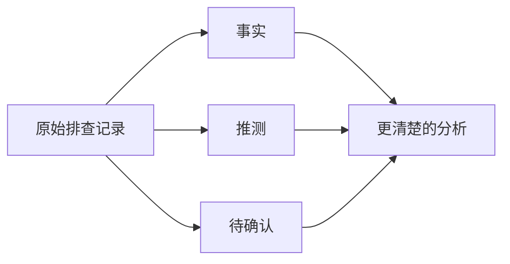

这个例子也把第二篇和第三篇连了起来：

- 第二篇讲：Prompt 要把任务说明清楚。
- 第三篇讲：因为模型是生成式的，所以更要控制边界和校验方式。

## 怎么看待“大模型理解了人类语言吗”

这是一个挺容易争论的问题。

大模型到底算不算“理解”？  
这里不急着给哲学答案。

从使用角度，可以先这样看：

> 它能够在语言层面捕捉上下文、任务、语义关系和表达模式，并生成对人有用的回答。  
> 但它的理解方式和人的理解方式不一样，也不能等同于人类经验、意识或真实世界验证。

这个判断比较克制，但对使用很有帮助。

| 问题 | 阶段性看法 |
| --- | --- |
| 它能不能理解上下文？ | 能在统计和表示层面捕捉上下文关系 |
| 它是不是像人一样理解？ | 不能简单等同 |
| 它为什么看起来懂很多？ | 因为训练数据、模型规模和上下文建模能力很强 |
| 它为什么还会犯低级错误？ | 因为生成合理文本不等于验证真实世界 |
| 该不该用它？ | 应该用，但要知道边界 |

这个态度很重要。  
既不要神化，也不要贬低。

它不是一个全知老师，也不是一个随机胡说的玩具。  
它更像一个强大的语言与模式生成系统：用得好可以放大效率，用不好也会放大错误。

## 这一篇留下的核心模型

写到这里，真正要留下的不是一堆术语，而是一条主线。

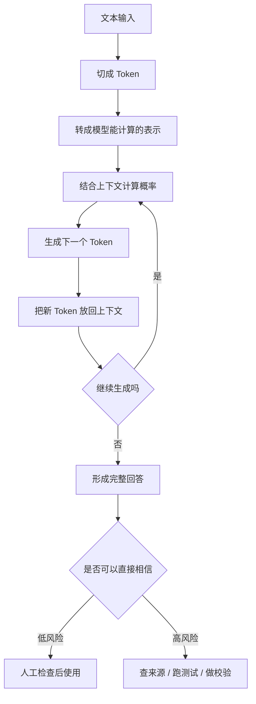

这张图把整篇文章的理解串起来了：

1. 模型先把文本拆成 Token。
2. Token 会进入模型内部计算。
3. 模型根据上下文预测下一个 Token。
4. 回答是一点点生成出来的。
5. 生成式能力带来灵活性，也带来幻觉风险。
6. 使用模型时，要区分低风险探索和高风险决策。

## 最后总结：大模型是在“接着上下文往下写”

理解到这里，大模型生成回答这件事就更具体了。

它不是简单地在“查答案”。  
更适合理解成：

> 大模型是在当前上下文基础上，不断判断下一个 Token 应该是什么，然后一步步生成回答。

这个机制解释了很多现象：

- 为什么 Prompt 写法会影响输出
- 为什么上下文越清楚，回答越贴近需求
- 为什么同一个问题可能得到不同表达
- 为什么模型能写出新内容
- 为什么模型也可能一本正经地说错

这篇不是要把模型原理一次性讲完。  
更重要的是先搭起一个简化但有用的理解框架。

后面继续学 Token、Embedding、向量检索、RAG、工具调用时，还会不断回到这条主线：

**模型的回答不是从某个固定答案库里取出来的，而是在上下文约束下生成出来的。**

理解这一点以后，对大模型的期待会更合理：

它很强，但不是事实机器。  
它很会表达，但表达不等于验证。  
它能帮助我们快速整理、解释、推理和生成，但最终哪些内容能进入真实工作，还需要设计边界、给出资料、检查依据，并在关键场景里保留人的判断。

这篇先把一个基础判断立住：模型的回答不是从固定答案库里取出来的，而是在上下文约束下生成出来的。


