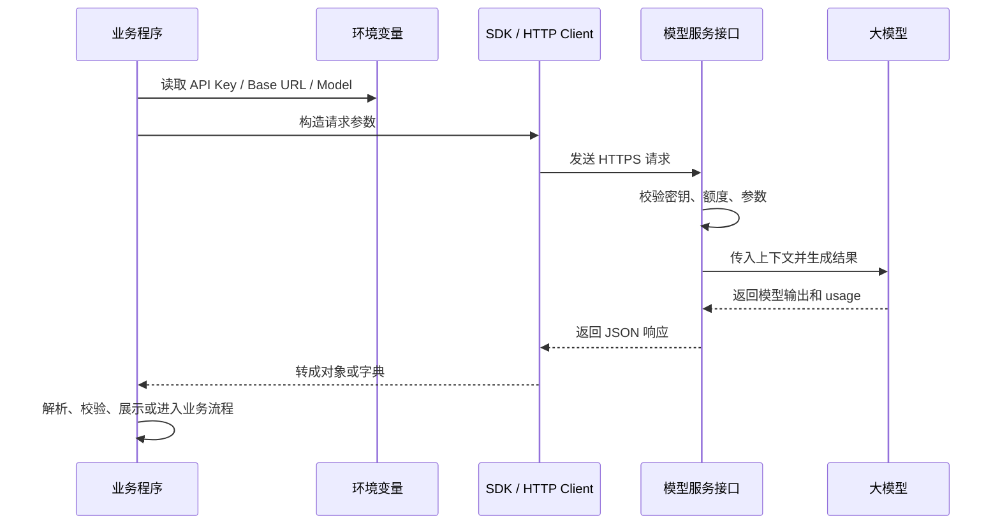
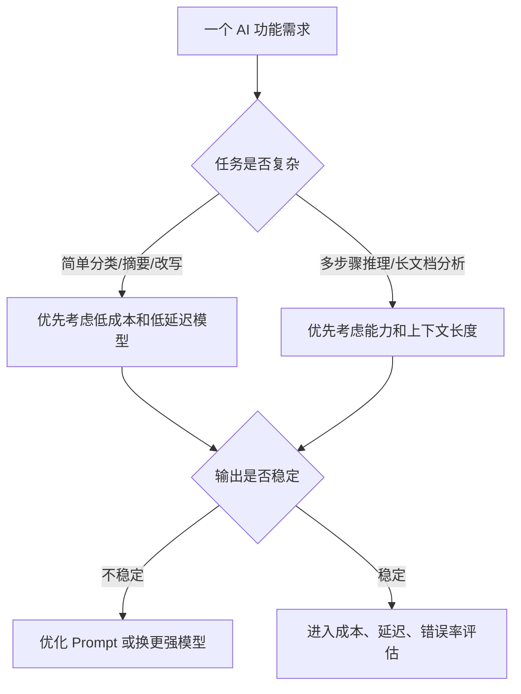
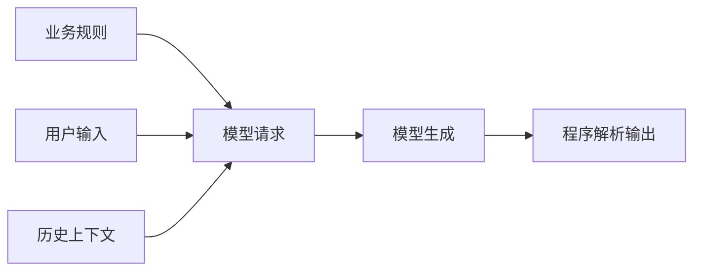
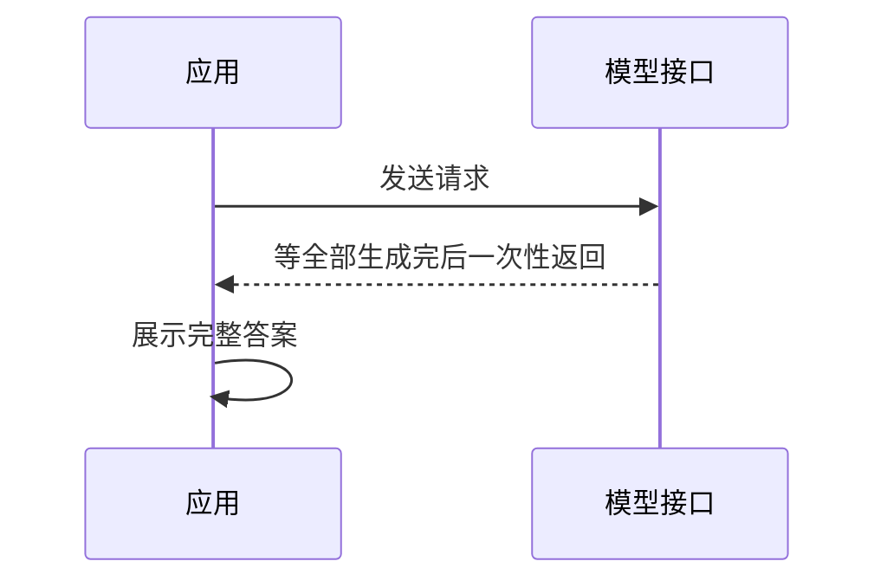
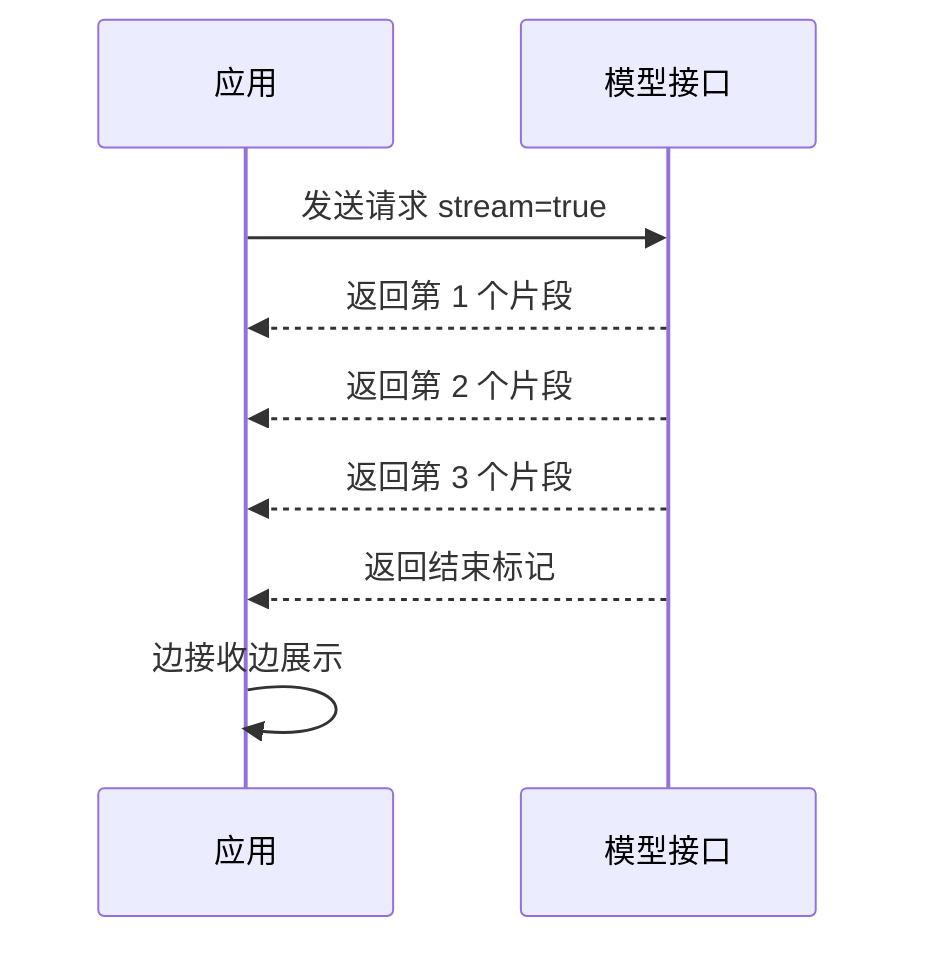
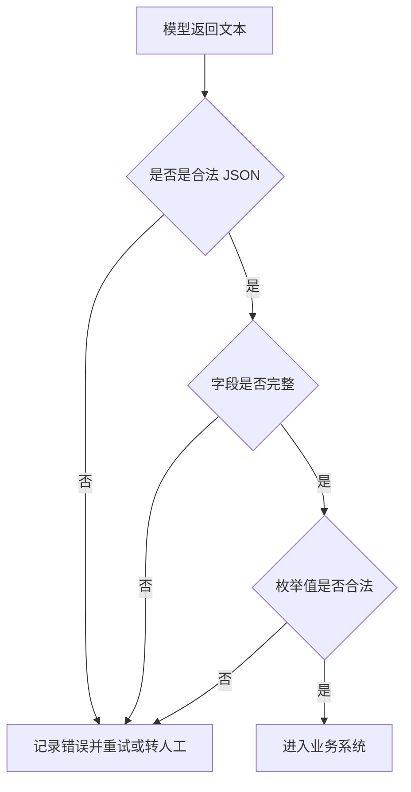
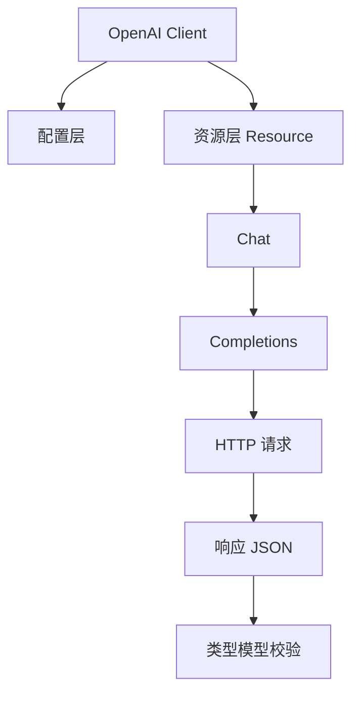

# 大模型学习笔记 04：用 API 把大模型接入程序

前面几篇先把三个问题立住了：大模型是什么，Prompt 为什么不是随便提问，以及模型为什么是“按概率生成回答”。但只在网页聊天框里使用模型，仍然像是在使用一个现成产品。

真正把大模型放进自己的业务系统里，通常要跨过这一关：**用 API 调用模型**。

这一步看起来像是“写几行代码发个请求”，但它背后其实发生了一个身份转换：

> 大模型不再只是一个聊天页面，而变成程序可以调用的一种能力。

这篇先解决一个基础问题：当程序调用大模型时，API Key、Base URL、Model、Messages、响应字段、流式输出这些东西到底各自负责什么。

## 这一篇先学什么

| 学习点 | 需要想明白的问题 | 暂时不展开的内容 |
| --- | --- | --- |
| API 调用 | 网页聊天和代码调用有什么不同 | 复杂应用架构 |
| API Key | 程序凭什么访问模型服务 | 权限系统、密钥轮换策略 |
| Base URL | 请求到底发到哪里 | 私有化部署、网关治理 |
| Model | 为什么调用时要指定模型 | 模型评测和选型体系 |
| Messages / Input | 程序如何把上下文传给模型 | 复杂多轮记忆 |
| SDK / HTTP | 为什么既可以用 SDK，也可以直接发请求 | SDK 内部完整实现 |
| Response | 返回结果为什么不能只看正文 | 日志、追踪、成本核算 |
| Streaming | 为什么很多 AI 产品要边生成边显示 | 实时语音、多模态流 |

## 一个常见误解：API 只是把网页聊天搬到代码里？

刚开始接触 API 时，很容易把它理解成：

```text
网页上输入一句话 -> 模型回答
代码里传一句话 -> 模型回答
```

这个理解没有错，但太薄了。

网页聊天更像一个完整产品，很多事情已经被产品层包好了：登录、会话记录、输入框、输出展示、模型选择、安全策略、错误提示。API 调用则更底层，它只提供一个能力入口。应用程序需要自己决定：什么时候调用、传什么上下文、如何展示结果、如何处理失败、如何控制成本、如何避免敏感信息泄露。

可以用下面这张表区分：

| 对比项 | 网页聊天 | API 调用 |
| --- | --- | --- |
| 使用者 | 人直接操作 | 程序调用 |
| 输入方式 | 在输入框里写自然语言 | 构造 JSON 请求 |
| 上下文管理 | 平台帮你保存会话 | 程序自己传历史消息或状态 |
| 输出处理 | 展示在页面上 | 程序解析后进入业务流程 |
| 错误处理 | 页面提示失败 | 程序要处理异常、重试、降级 |
| 成本控制 | 用户体感不明显 | 需要统计 token 和调用次数 |
| 安全边界 | 平台产品承担一部分 | 业务系统必须自己设计边界 |

所以 API 不是“聊天框的代码版”，更准确地说，它是把模型能力接入系统的一条通道。

## 一次 API 调用到底发生了什么

从程序视角看，一次最普通的大模型调用大概会经过这些步骤：



这张图里有一个很重要的变化：网页聊天时，人只关心“模型回了什么”；API 调用时，程序还要关心“请求有没有成功、用了多少 token、是否被截断、返回结构是否符合预期、失败后怎么办”。

## API Key：不是密码，但要像密码一样保护

API Key 可以理解成访问模型服务的凭证。服务端收到请求后，会根据它判断：

- 这个请求属于哪个账号或项目。
- 这个账号是否有权限调用接口。
- 是否还有额度。
- 调用记录和费用应该算到哪里。

所以代码里绝对不要这样写：

```python
from openai import OpenAI

client = OpenAI(
    api_key="your_api_key_here"
)
```

更稳的做法是从环境变量读取：

```powershell
setx OPENAI_API_KEY "your_api_key_here"
```

```python
from openai import OpenAI

client = OpenAI()
```

官方 OpenAI SDK 会默认从环境变量里读取 `OPENAI_API_KEY`。如果使用 OpenAI 兼容接口，也可以显式传入 `api_key` 和 `base_url`，但仍然建议从环境变量读取：

```python
import os
from openai import OpenAI

client = OpenAI(
    api_key=os.environ["OPENAI_API_KEY"],
    base_url=os.getenv("OPENAI_BASE_URL", "https://api.openai.com/v1"),
)
```

这里有一个工程习惯需要尽早建立：**密钥不进代码仓库，不进 Prompt，不进日志，不截图传播**。

## Base URL：请求发往哪里

`Base URL` 是模型服务接口的基础地址。

比如官方 OpenAI API 常见地址是：

```text
https://api.openai.com/v1
```

很多模型服务会兼容 OpenAI 的接口格式，这时只要替换 `base_url`、`api_key`、`model`，同一套代码就有机会切换到不同模型供应商。

```python
client = OpenAI(
    api_key=os.environ["MODEL_API_KEY"],
    base_url=os.environ["MODEL_BASE_URL"],
)
```

可以先把它理解成：

| 配置项 | 类比 | 作用 |
| --- | --- | --- |
| `api_key` | 门禁卡 | 证明你有权限访问 |
| `base_url` | 公司地址 | 决定请求发到哪个服务 |
| `model` | 找哪个人处理 | 决定由哪个模型生成回答 |
| `messages` / `input` | 任务资料 | 告诉模型这次要处理什么 |

这个类比不严谨，但能帮助建立第一层直觉：**API 调用不是只传一句话，而是在指定服务、指定模型、指定上下文后，发起一次受控请求。**

## Model：不是随便填一个名字

调用接口时通常要指定 `model`：

```python
response = client.responses.create(
    model="gpt-5.6",
    input="把下面这条用户反馈分类为：性能问题、支付问题、账号问题、其他。反馈：页面提交后一直转圈。"
)
```

`model` 决定了这次请求使用哪个模型。不同模型之间通常会有差异：

| 差异 | 影响 |
| --- | --- |
| 能力 | 推理、代码、多模态、长文本处理能力不同 |
| 速度 | 有的模型更快，适合实时交互 |
| 成本 | 输入和输出 token 单价可能不同 |
| 上下文长度 | 能放进去的历史消息和文档长度不同 |
| 输出稳定性 | 同样任务下格式遵循能力可能不同 |

在真实项目里，模型选择不应该只看“哪个最强”。例如用户反馈分类、标题生成、简单摘要，未必需要最强模型；复杂代码分析、长文档推理、法律条款对照，则需要更强的上下文和推理能力。

更实用的判断是：



模型选择是工程问题，不是单纯的参数问题。

## Messages / Input：把“对话”变成结构化上下文

很多入门示例常见的写法是 Chat Completions 风格：

```python
result = client.chat.completions.create(
    model="gpt-4.1-mini",
    messages=[
        {"role": "system", "content": "你是一个客服反馈分类助手，只输出 JSON。"},
        {"role": "user", "content": "用户反馈：支付页面一直转圈，刷新后订单也没有生成。"}
    ],
)

print(result.choices[0].message.content)
```

这里的 `messages` 不是普通字符串，而是一个有角色的消息列表。

| role | 含义 | 常见用途 |
| --- | --- | --- |
| `system` | 系统规则 | 定义角色、边界、输出格式、拒答要求 |
| `user` | 用户输入 | 这次真正要处理的问题或资料 |
| `assistant` | 模型历史回复 | 多轮对话时保留模型之前说过什么 |
| `tool` | 工具返回结果 | 工具调用后把执行结果交回模型 |

官方 OpenAI 新项目里更推荐使用 Responses API，基础写法会变成：

```python
from openai import OpenAI

client = OpenAI()

response = client.responses.create(
    model="gpt-5.6",
    instructions="你是一个客服反馈分类助手，只输出 JSON。",
    input="用户反馈：支付页面一直转圈，刷新后订单也没有生成。"
)

print(response.output_text)
```

这两种写法的名称不同，但学习时可以先抓住共同点：



也就是说，不管叫 `messages` 还是 `input`，本质都是把“这次希望模型依据什么来回答”组织清楚。

## SDK 和 HTTP：一个负责好用，一个负责看清底层

调用大模型一般有两种方式：

| 方式 | 示例 | 适合场景 |
| --- | --- | --- |
| SDK | `client.responses.create(...)` | 日常开发，少写样板代码 |
| HTTP | `curl https://api.openai.com/v1/responses` | 调试接口、理解协议、跨语言调用 |

SDK 的好处是把很多重复工作封装好了，比如请求头、JSON 序列化、响应对象、错误类型、流式事件处理。HTTP 的好处是透明，能看到请求到底发了什么。

用 HTTP 直接调用时，请求大概长这样：

```bash
curl https://api.openai.com/v1/responses \
  -H "Content-Type: application/json" \
  -H "Authorization: Bearer $OPENAI_API_KEY" \
  -d '{
    "model": "gpt-5.6",
    "instructions": "你是一个客服反馈分类助手，只输出 JSON。",
    "input": "用户反馈：支付页面一直转圈，刷新后订单也没有生成。"
  }'
```

把这段拆开看，会发现 API 请求无非是三层：

```text
URL：请求发到哪里
Headers：我是谁、数据是什么格式
Body：我要模型做什么
```

SDK 只是把这三层封装成了更适合程序员使用的函数调用。

## 返回结果：不要只盯着正文

很多入门示例最后都会写：

```python
print(response.output_text)
```

或者：

```python
print(result.choices[0].message.content)
```

这是最容易看到效果的写法，但真实项目里不能只盯着正文。一次模型调用至少还要关注这些信息：

| 字段或信息 | 为什么重要 |
| --- | --- |
| `id` | 方便日志追踪和问题排查 |
| `model` | 确认实际调用了哪个模型 |
| `content` / `output_text` | 业务真正需要的文本 |
| `finish_reason` | 判断是否正常结束、是否被截断、是否触发工具调用 |
| `usage` | 统计 token 消耗和成本 |
| 错误码 | 判断是参数问题、额度问题、限流还是服务异常 |

例如 Chat Completions 风格的响应常见层级是：

```text
ChatCompletion
├── id
├── model
├── choices[]
│   └── message
│       ├── role
│       └── content
└── usage
    ├── prompt_tokens
    ├── completion_tokens
    └── total_tokens
```

如果程序只写 `choices[0].message.content`，功能能跑起来，但排查问题时会很被动。比如用户说“刚才怎么没答完”，真正要看的可能是 `finish_reason` 是否等于 `length`，也就是输出到了长度上限被截断。

## Token 成本：API 调用必须有成本意识

API 调用通常按输入和输出 token 计费。入门阶段不用马上背价格表，但要理解一个基本公式：

$$
\text{总成本} = \text{输入 token 数} \times \text{输入单价} + \text{输出 token 数} \times \text{输出单价}
$$

这个公式想解决的问题是：一次模型调用到底花了多少钱。

其中：

- $\text{输入 token 数}$ 表示 Prompt、系统规则、历史消息、文档片段等输入内容消耗的 token。
- $\text{输出 token 数}$ 表示模型生成答案消耗的 token。
- $\text{输入单价}$ 和 $\text{输出单价}$ 通常由模型服务商按模型分别定价。
- 输出 token 的单价往往不一定等于输入 token，具体以服务商价格页为准。

代入一个小例子。假设某个模型的输入单价是每 100 万 token 1 元，输出单价是每 100 万 token 4 元。一次请求用了 2,000 个输入 token，生成了 500 个输出 token：

$$
输入成本 = \frac{2000}{1000000} \times 1 = 0.002
$$

$$
输出成本 = \frac{500}{1000000} \times 4 = 0.002
$$

$$
总成本 = 0.002 + 0.002 = 0.004
$$

这个结果可以这样理解：单次看起来很便宜，但如果一个接口每天调用 100 万次，成本就会被放大。更麻烦的是，长上下文、历史对话、RAG 文档片段都会增加输入 token。

工程里常见的成本控制方式包括：

- 不把无关历史消息一直塞进上下文。
- 对长文档先切分和检索，而不是整篇丢给模型。
- 简单任务使用更轻量的模型。
- 对重复问题做缓存。
- 记录每次调用的 `usage`，按功能统计成本。

这也是为什么 Token 后面值得单独写一篇。它不是抽象概念，而是上下文、速度和费用的共同单位。

## 流式响应：为什么 AI 产品喜欢“边想边输出”

非流式调用是这样：



如果模型需要 8 秒生成完整答案，用户就要等 8 秒才能看到任何内容。

流式响应则不同：



在很多接口里，流式输出底层会使用 SSE，也就是 Server-Sent Events。可以先把它理解成：服务端不等答案全部生成完，而是把生成过程中的文本片段一段段推给客户端。

Python 里通常会写成：

```python
from openai import OpenAI

client = OpenAI()

stream = client.responses.create(
    model="gpt-5.6",
    input="请用三句话解释什么是 API 调用。",
    stream=True,
)

for event in stream:
    print(event)
```

如果是 Chat Completions 兼容接口，常见处理逻辑会变成读取 `delta.content`：

```python
stream = client.chat.completions.create(
    model="gpt-4.1-mini",
    messages=[
        {"role": "user", "content": "请用三句话解释什么是 API 调用。"}
    ],
    stream=True,
)

for chunk in stream:
    if not chunk.choices:
        continue
    delta = chunk.choices[0].delta.content
    if delta:
        print(delta, end="", flush=True)
```

流式响应主要解决的是用户体验问题。它不一定让模型生成得更快，但能让用户更早看到反馈。聊天产品、代码助手、文档总结、长报告生成，都很适合流式输出。

## 一个更贴近开发的例子：用户反馈分类

假设系统里有一批用户反馈，需要初步归类，方便产品和研发看问题分布。这个场景比“写学习笔记”更接近真实业务。

输入可能是：

```text
用户反馈：点击提交订单后页面一直转圈，等了很久也没有成功，刷新后订单列表里看不到刚才的订单。
```

希望模型输出稳定的 JSON：

```json
{
  "category": "性能问题",
  "priority": "P1",
  "summary": "提交订单后页面长时间无响应，且订单未生成",
  "need_human_check": true
}
```

一个更适合程序调用的 Prompt 可以这样写：

```text
你是一个用户反馈分类助手。

请根据用户反馈输出 JSON，不要输出 Markdown，不要补充解释。

分类只能从以下选项中选择：
- 性能问题
- 支付问题
- 账号问题
- 数据问题
- 其他

优先级只能从 P0、P1、P2、P3 中选择。

判断规则：
- 如果影响下单、支付、登录等核心流程，优先级至少为 P1。
- 如果只是文案、样式、轻微体验问题，通常为 P3。
- 如果信息不足，category 选择“其他”，need_human_check 为 true。

用户反馈：
点击提交订单后页面一直转圈，等了很久也没有成功，刷新后订单列表里看不到刚才的订单。
```

这里的重点不是 Prompt 写得多漂亮，而是它已经开始面向程序：

| 设计点 | 目的 |
| --- | --- |
| 限定分类枚举 | 方便后续入库和统计 |
| 要求 JSON | 方便程序解析 |
| 不输出 Markdown | 减少解析干扰 |
| 定义优先级规则 | 降低模型自由发挥 |
| `need_human_check` | 给不确定结果留人工确认口 |

API 接入大模型时，Prompt 其实已经变成了业务协议的一部分。写得越随意，下游程序越痛苦。

## 程序不能无条件相信模型输出

即使 Prompt 写了“只输出 JSON”，模型也可能输出多余文本、字段缺失、字段类型不对，或者把分类写成枚举之外的词。

所以真实项目里，模型输出后最好再走一层校验：



伪代码可以长这样：

```python
import json

ALLOWED_CATEGORY = {"性能问题", "支付问题", "账号问题", "数据问题", "其他"}
ALLOWED_PRIORITY = {"P0", "P1", "P2", "P3"}

def parse_feedback_result(text: str) -> dict:
    data = json.loads(text)

    if data.get("category") not in ALLOWED_CATEGORY:
        raise ValueError("invalid category")

    if data.get("priority") not in ALLOWED_PRIORITY:
        raise ValueError("invalid priority")

    if not isinstance(data.get("need_human_check"), bool):
        raise ValueError("invalid need_human_check")

    return data
```

这个例子背后有一个原则：**模型输出是候选结果，不是系统事实。**

只要结果会进入数据库、触发工单、发送消息、调用工具、改变订单状态，就不能直接相信模型。先校验，再使用。

## 自己实现一个轻量 SDK，主要是在理解什么

有些练习会要求“自己实现 Completions”。这个练习的价值不只是写一个玩具版 SDK，而是帮助理解 SDK 里面大概分了几层：



拆开看：

| 层次 | 负责什么 |
| --- | --- |
| Client | 保存 `api_key`、`base_url`、超时配置 |
| Resource | 把 API 按能力组织起来，例如 `chat.completions` |
| HTTP | 拼 URL、加 Header、发送请求 |
| Types | 把 JSON 响应转成可访问的结构 |
| Error Handling | 处理超时、限流、鉴权失败、服务异常 |

理解这层结构之后，再看 `client.chat.completions.create()` 就不会觉得它是魔法。它本质上是在帮程序完成：

```text
构造请求 -> 发送 HTTP -> 收到 JSON -> 校验结构 -> 返回对象
```

官方 SDK 做得更完整，自己实现只是为了拆开看清楚。

## API 接入时先建立几条边界

这一篇还没有进入工具调用、Agent、RAG，但 API 接入阶段已经需要建立边界意识。

| 风险 | 例子 | 更稳的做法 |
| --- | --- | --- |
| 密钥泄露 | 把 API Key 写进代码或发给模型 | 使用环境变量和密钥管理 |
| Prompt 注入 | 用户输入里夹带“忽略系统规则” | 系统规则和用户输入分层，输出再校验 |
| 输出不可控 | 模型返回非 JSON 或编造字段 | 使用结构化输出约束和程序校验 |
| 成本失控 | 把整段历史和长文档反复传入 | 控制上下文长度，记录 usage |
| 误触发业务动作 | 模型结果直接创建订单、发送通知 | 加权限控制、人工确认或灰度策略 |

这些规则不是为了把 API 调用想得很危险，而是为了避免把“能跑通 Demo”误认为“能上线”。

## 这一篇可以先收束成一句话

用 API 接入大模型，本质上是把“自然语言能力”包装成程序可以调用的服务。

它需要的不只是会写：

```python
client.responses.create(...)
```

更重要的是理解这一整条链路：

```text
密钥鉴权 -> 选择模型 -> 构造上下文 -> 发起请求 -> 接收响应 -> 解析校验 -> 记录成本 -> 处理异常
```

当这条链路想清楚之后，后面再学 Token、Embedding、RAG、Function Calling、Agent，就不会只是记概念。因为它们最终都会回到同一个问题：如何让模型能力稳定、安全、可控地进入真实程序。

## 参考资料

- [OpenAI API Quickstart](https://developers.openai.com/api/docs/quickstart)
- [OpenAI Responses API](https://developers.openai.com/api/docs/api-reference/responses)
- [OpenAI Streaming Responses](https://developers.openai.com/api/docs/guides/streaming-responses)


