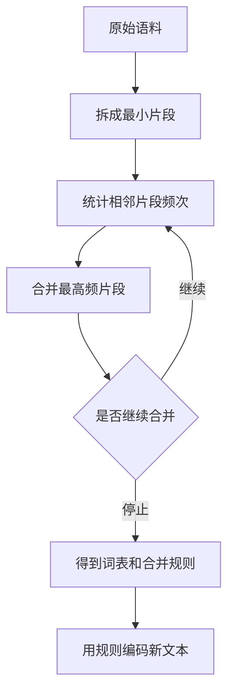
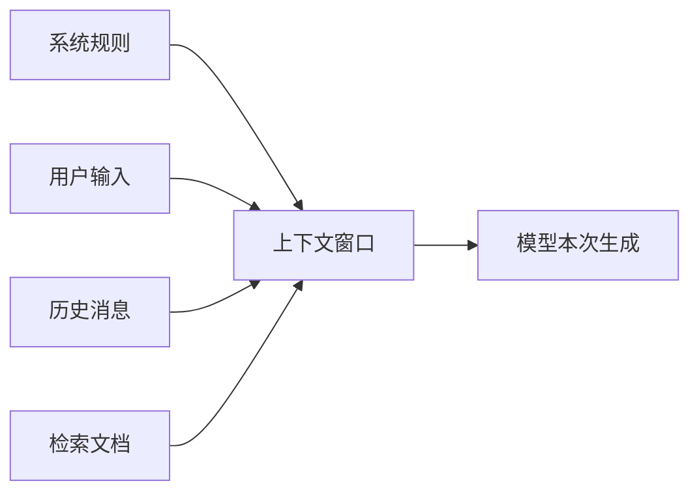
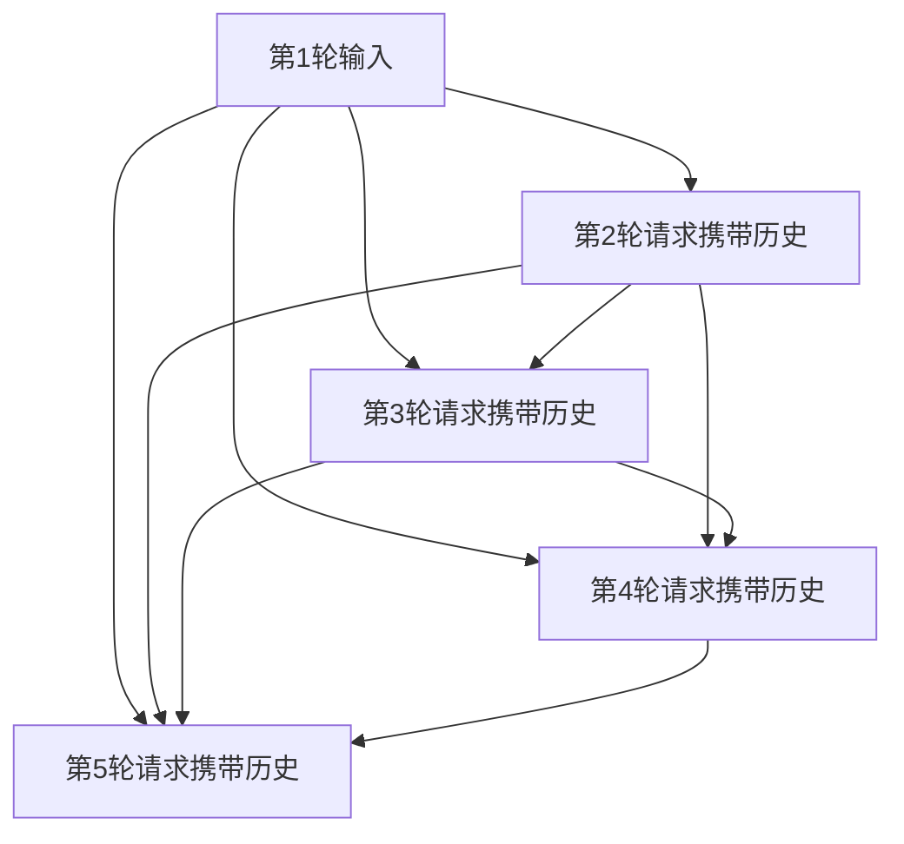
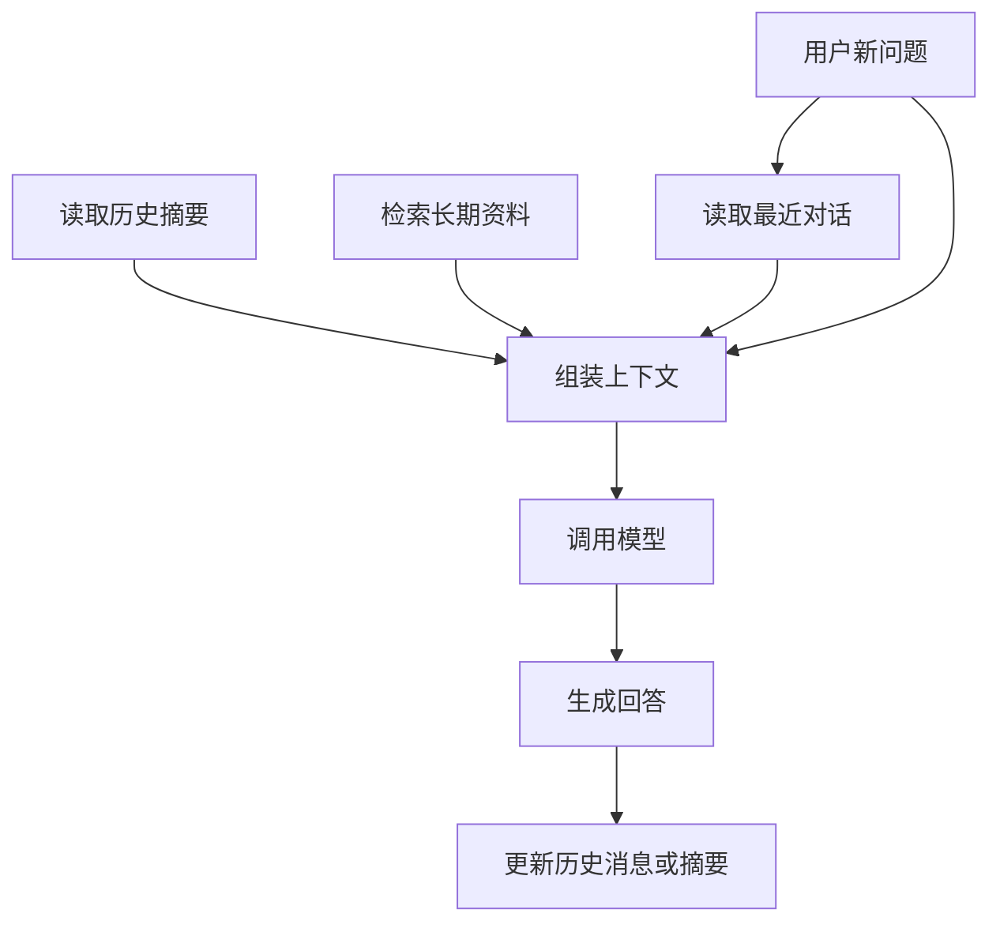
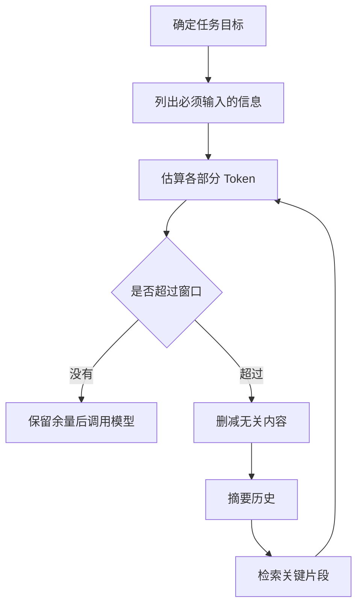
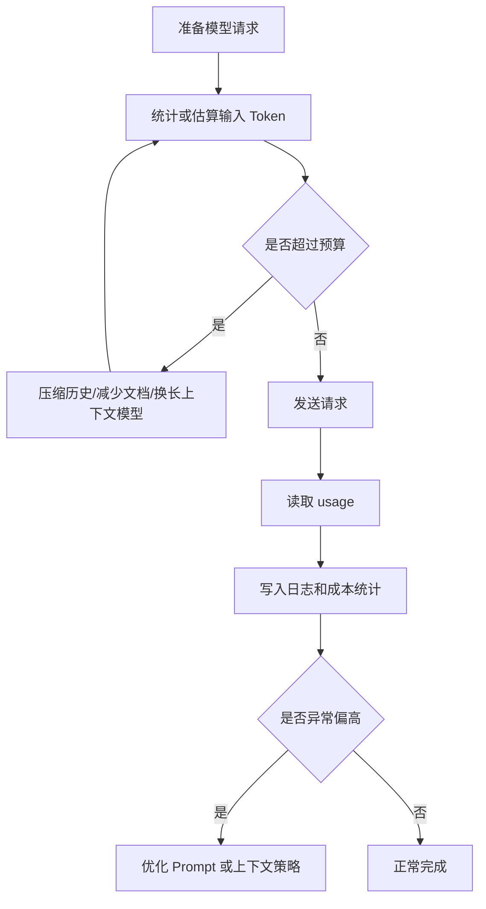

# 大模型学习笔记 05：Token：上下文、记忆和成本的基本单位

学大模型时，`Token` 是一个看起来很小、但越往后越绕不开的概念。

从聊天框到 API 调用，Token 都不是一个可有可无的小概念。它会直接影响模型能看见多少内容、一次请求要花多少钱，以及多轮对话为什么会越聊越重。

刚开始很容易把它理解成“字数”或者“单词数”。但继续往 API、长文本、RAG、多轮对话、成本控制这些方向走，就会发现这个理解不够用。

更适合的理解是：

> Token 是模型处理文本、计算上下文、统计成本的基本单位。

也就是说，它不只是一个计数单位，还影响三件很实际的事情：

- 一段内容能不能塞进模型的上下文窗口。
- 多轮对话为什么会越来越长、越来越贵。
- 为什么同样一句话，不同模型算出来的 Token 数可能不一样。

这篇先把 Token 这件事讲清楚。后面学 Embedding、RAG、文本切分、上下文记忆时，很多问题都会回到这里。

## 这一篇先学什么

| 学习点 | 要解决的问题 | 工程里的影响 |
| --- | --- | --- |
| Token | 模型到底按什么单位读文本 | 影响输入长度、输出长度、计费 |
| Tokenizer | 文本如何变成 Token ID | 不同模型不能随便混用分词器 |
| BPE | 为什么一个词可能被拆成多个片段 | 解释中文、英文、符号的 Token 差异 |
| 上下文窗口 | 为什么长文档不能无限塞给模型 | 决定是否需要切分、摘要、检索 |
| 多轮对话 | 为什么聊天越久成本越高 | 历史消息会反复进入输入 |
| 本地计数和 usage | 为什么本地估算不一定等于 API 账单 | 实际成本以 API 返回为准 |
| Token 预算 | 怎么在项目前先估算风险 | 控制长度、延迟和费用 |

## Token 不是字数，也不是简单的单词数

先看一个直觉例子。

```text
hello world
你好世界
Python 是一门简洁易学的编程语言。
user_id = 1024
```

如果按人类阅读习惯看：

- `hello world` 像是 2 个英文单词。
- `你好世界` 像是 4 个汉字。
- `user_id = 1024` 像是一段代码或日志字段。

但模型不会直接按“单词”或“汉字”来读。模型实际看到的是分词器处理后的 Token ID 序列。

可以把过程理解成：


其中 `Token ID` 通常是整数，例如：

```text
文本：hello world
Token ID：[15339, 1917]
```

这组数字只是示意，不同模型、不同分词器、不同版本下结果可能不同。重点在于：**模型不是直接读字符串，而是读一串整数编号。**

## Tokenizer：文本和模型之间的翻译器

`Tokenizer` 可以理解成文本和模型之间的翻译器。

它做两件事：

| 动作 | 含义 | 例子 |
| --- | --- | --- |
| Encode | 把文本转成 Token ID | `"hello"` -> `[15339]` |
| Decode | 把 Token ID 还原成文本 | `[15339]` -> `"hello"` |

这个过程类似把自然语言变成模型能处理的数据结构：

```text
人类文本：接口响应很慢
Token 片段：["接口", "响应", "很", "慢"]  （示意）
Token ID：[78641, 33210, 1234, 9987]       （示意）
```

这里要特别注意：Token 片段和 Token ID 的例子只是帮助理解，不能当作固定结果。真正项目里要用和模型匹配的分词器统计。

## 为什么不同模型不能混用分词器

不同模型可能使用不同词表和分词规则。

同一句话，用不同分词器算出来的 Token 数可能不同：

| 文本 | 分词器 A | 分词器 B | 说明 |
| --- | --- | --- | --- |
| `你是谁?` | 可能是 2 tokens | 可能是 4 tokens | 中文、标点的处理规则不同 |
| `hello world` | 可能是 2 tokens | 可能是 3 tokens | 空格、常见词片段规则不同 |
| `user_id` | 可能拆成 `user`、`_id` | 可能拆成 `user`、`_`、`id` | 代码符号会影响切分 |

所以项目里不能这样想：

```text
我用任意一个分词器算一下，大概就等于 API 计费数量。
```

更稳的规则是：

| 对接对象 | 应该怎么计数 |
| --- | --- |
| OpenAI 模型 | 使用官方 Token counting API，或用匹配的 OpenAI 分词库做本地估算 |
| DeepSeek 模型 | 使用 DeepSeek 对应分词器或 API 返回的 usage |
| 其他兼容 OpenAI 接口的模型 | 看供应商是否提供自己的分词器和 usage 字段 |

**分词器必须跟模型对应。**  
这个规则比记住某个具体库更重要。

## BPE：为什么文本会被切成奇怪的片段

很多现代大模型分词器会使用 BPE 或类似思路。BPE 全称是 Byte Pair Encoding，可以翻译成“字节对编码”。

它想解决的问题是：如果只按字符处理，序列太长；如果只按完整单词处理，词表又会太大，而且遇到新词、拼写变化、代码符号会很麻烦。

BPE 的折中思路是：

> 从小片段开始，反复把语料里最常一起出现的相邻片段合并成更大的片段。

可以用一个很小的例子理解。

假设训练语料是：

```text
hello hello hello help
```

最开始可以把单词拆成字符：

```text
h e l l o
h e l l o
h e l l o
h e l p
```

然后统计哪些相邻字符最常一起出现。

| 相邻片段 | 出现次数 |
| --- | --- |
| `h` + `e` | 4 |
| `e` + `l` | 4 |
| `l` + `l` | 3 |
| `l` + `o` | 3 |
| `l` + `p` | 1 |

假设第一轮合并 `h + e -> he`，文本会变成：

```text
he l l o
he l l o
he l l o
he l p
```

再继续合并高频片段，例如：

```text
he + l -> hel
hel + l -> hell
hell + o -> hello
```

最终，常见的 `hello` 可能成为一个 Token，而不常见的词仍然会被拆成多个片段。



这个机制能解释很多现象：

- 高频词可能用很少 Token 表示。
- 生僻词可能被拆成多个 Token。
- 代码、符号、URL、JSON 字段可能被拆得比较碎。
- 中文是否更省 Token，取决于该模型词表怎么设计，不能只按字符数判断。

## 一个小公式：Token 数怎么影响上下文

大模型有上下文窗口，也就是一次请求中模型最多能接收和生成多少 Token。

可以先用这个公式理解：

$$
\text{总 Token 数} = \text{输入 Token 数} + \text{输出 Token 数}
$$

这个公式想解决的问题是：一次请求会不会超过模型的上下文窗口。

其中：

- $\text{输入 Token 数}$ 包括系统规则、用户问题、历史对话、文档片段、工具定义等。
- $\text{输出 Token 数}$ 是模型生成回答时消耗的 Token。
- $\text{总 Token 数}$ 必须落在模型支持的上下文窗口内。

如果某个模型上下文窗口是 $128000$ tokens，一次请求输入已经用了 $120000$ tokens，那么留给输出的空间最多只有：

$$
128000 - 120000 = 8000
$$

这意味着即使模型本身很强，也不是“想让它写多少就写多少”。如果输入太长，模型可能直接报错，或者输出被限制得很短。

在工程里，这个公式会变成一个很实际的预算问题：

```text
系统规则：2,000 tokens
历史对话：15,000 tokens
检索文档：80,000 tokens
用户问题：500 tokens
期望输出：4,000 tokens
```

那么总量大约是：

$$
2000 + 15000 + 80000 + 500 + 4000 = 101500
$$

如果模型窗口是 128K，这次请求还有余量；如果模型窗口是 32K，这个设计就完全不可行。

## 上下文窗口：不是记忆，而是本次可见范围

“上下文窗口”很容易被误解成模型的记忆。

更准确的说法是：上下文窗口是模型在这一次生成时能看到的内容范围。

可以把它想成一次考试时摊在桌面上的资料：

- 桌面够大，可以放更多资料。
- 桌面不够大，就必须删掉、压缩、摘要或只拿关键页。
- 模型生成回答时，只能依据桌面上可见的资料。



上下文窗口不是无限记忆。即使网页聊天产品看起来能“记住前面说过的话”，本质上通常也是产品层把历史消息、摘要或外部记忆重新组织后，再放进新的请求里。

这就解释了一个常见现象：

```text
为什么对话聊久了，模型会忘记前面的细节？
```

因为前面的内容可能已经不在本次上下文窗口里了，或者被摘要压缩过，细节丢失了。

## 多轮对话为什么会越来越贵

多轮对话不是每次只发送“最新一句话”。为了让模型理解上下文，程序通常会把历史消息一起发送。

假设一个客服助手对话如下：

```text
第 1 轮：用户描述订单提交失败
第 2 轮：模型询问订单号和时间
第 3 轮：用户补充浏览器和报错截图说明
第 4 轮：模型给出排查建议
第 5 轮：用户继续追问是否需要联系后端
```

如果程序把完整历史都带上，第 5 轮请求的输入会包含前 4 轮内容。



这也是多轮对话成本增加的根本原因：**历史内容会反复成为新的输入 Token。**

可以用一个简化公式估算多轮对话的输入成本增长：

$$
\text{第}n\text{轮输入 Token 数} \approx \text{系统规则} + \text{历史消息 Token 数} + \text{当前用户消息 Token 数}
$$

假设：

- 系统规则固定是 $500$ tokens。
- 每轮用户和模型合计新增 $800$ tokens。
- 当前用户消息是 $100$ tokens。

第 1 轮大约是：

$$
500 + 0 + 100 = 600
$$

第 5 轮时，前 4 轮历史约为：

$$
4 \times 800 = 3200
$$

所以第 5 轮输入约为：

$$
500 + 3200 + 100 = 3800
$$

这个数字还没有算输出。如果继续聊下去，输入会越来越大，延迟和费用也会一起上升。

## 记忆：这里先指会话里的历史消息

在应用开发里，经常会听到“短期记忆”“长期记忆”。这两个词容易让人误会，以为模型内部自动保存了所有聊天记录。

这里先只把“记忆”理解成**会话里被带上的历史消息**。

更工程化的理解是：

| 类型 | 本质 | 常见做法 |
| --- | --- | --- |
| 短期记忆 | 当前对话上下文 | 带上最近几轮消息 |
| 压缩记忆 | 历史内容摘要 | 把长对话总结成短摘要 |
| 长期记忆 | 外部存储里的用户资料或知识 | 数据库、向量库、用户画像 |

也就是说，记忆通常不是模型内部永久存储，而是应用系统在每次请求前把相关信息重新放进上下文。



这也是为什么 Token 很关键。记忆越多，输入越长；输入越长，成本越高；成本越高，就必须做取舍。

## Token 和成本：价格不是按“调用次数”简单计算

大模型 API 的费用通常跟输入 Token 和输出 Token 有关。第 4 篇已经提过一次，这里再从 Token 角度展开。

一个常见的成本公式是：

$$
\text{总成本} = \text{输入 Token 数} \times \text{输入单价} + \text{输出 Token 数} \times \text{输出单价}
$$

这个公式想解决的问题是：一次模型调用到底会消耗多少费用。

其中：

- $\text{输入 Token 数}$ 是本次请求送给模型看的内容。
- $\text{输出 Token 数}$ 是模型生成的内容。
- $\text{输入单价}$ 和 $\text{输出单价}$ 通常按每 100 万 Token 计价。
- 不同模型的单价不同，具体以服务商价格为准。

代入一个小例子：

```text
输入：12,000 tokens
输出：1,500 tokens
输入单价：每 100 万 tokens 1 元
输出单价：每 100 万 tokens 4 元
```

输入成本：

$$
\frac{12000}{1000000} \times 1 = 0.012
$$

输出成本：

$$
\frac{1500}{1000000} \times 4 = 0.006
$$

总成本：

$$
0.012 + 0.006 = 0.018
$$

单次 $0.018$ 元看起来很低，但如果这个接口每天调用 $200000$ 次：

$$
0.018 \times 200000 = 3600
$$

这时成本就不再是小数点后的问题，而会变成产品功能是否值得、模型是否选对、Prompt 是否过长、缓存是否要做的工程问题。

## 本地计数和 API usage 为什么会不一致

实际开发里经常会遇到这个问题：

```text
本地分词器统计是 20 tokens，为什么 API 返回 prompt_tokens 是 28？
```

这是正常的。原因通常有几个：

| 差异来源 | 说明 |
| --- | --- |
| 消息格式开销 | `role`、消息边界、系统结构也可能消耗 Token |
| 工具定义 | 函数 schema、工具描述会进入上下文 |
| 多模态输入 | 图片、文件会按模型规则换算成 Token |
| 模型内部格式 | 某些模型会加入不可见的结构 Token |
| 分词器不匹配 | 用错分词器会直接导致估算偏差 |

官方 OpenAI 文档也强调：本地分词器适合纯文本估算，但如果请求里包含 messages、images、files、tools 等结构，最好使用对应的 token counting API 或以 API 返回的 usage 为准。

可以把三种数字分清楚：

| 数字 | 用途 | 可信度 |
| --- | --- | --- |
| 字符数 | 粗略感知文本长度 | 低 |
| 本地分词器估算 | 请求前做预算和拦截 | 中 |
| API `usage` | 实际计费和日志统计 | 高 |

在项目里，比较稳的策略是：

```text
请求前：用分词器或 token counting API 做预算
请求后：用 usage 字段记录真实消耗
长期：按功能统计平均 Token 和异常请求
```

## 为什么中文有时更耗 Token

中文 Token 问题也容易被简单化成一句话：“中文更耗 Token。”

这个说法有参考价值，但不能绝对化。更准确的理解是：**某段文本消耗多少 Token，取决于模型词表和分词规则。**

不过在很多模型里，中文确实更容易出现下面几种情况：

- 一个汉字可能就是一个 Token。
- 一些不常见词会被拆得更细。
- 中英文混排、代码符号、标点会增加切分复杂度。
- 专业名词、产品名、缩写可能没有完整词表匹配。

比如这两段内容长度接近，但 Token 数可能差异明显：

```text
The API request timed out after 30 seconds.
接口请求在 30 秒后超时。
```

英文里一些常见词和空格模式可能已经被词表很好地覆盖；中文如果按字或短片段切分，就可能占用更多 Token。

这对写 Prompt 有实际影响：

- 中文 Prompt 要给上下文窗口留余量。
- 长文档不要按字符数估算是否能塞进去。
- 面向多语言用户时，Token 成本可能不均匀。
- 代码、日志、JSON、URL 也要计入预算，不要只算自然语言。

## 上下文预算：写 AI 功能前先算一笔账

很多 AI 功能不是模型答不好，而是一开始就没有做上下文预算。

假设要做一个“客服工单辅助分析”功能。一次请求可能包含：

| 内容 | 估算 Token |
| --- | ---: |
| 系统规则 | 800 |
| 分类标准 | 1,200 |
| 用户工单正文 | 2,000 |
| 最近 5 条沟通记录 | 4,000 |
| 相关知识库片段 | 10,000 |
| 期望输出 | 1,000 |

总量约为：

$$
800 + 1200 + 2000 + 4000 + 10000 + 1000 = 19000
$$

如果模型上下文窗口是 32K，这个设计可行；如果还想额外塞入完整产品手册，可能马上超限。

更稳的上下文预算流程可以是：



这里的关键不是把数字算到绝对精确，而是提前知道哪部分最占空间。

## 常见坑：把“能塞进去”当成“应该塞进去”

现在很多模型上下文窗口越来越大，很容易让人产生一个错觉：

```text
既然能放 128K，那就把所有资料都丢进去。
```

这在工程上不一定是好选择。

长上下文会带来几个问题：

| 问题 | 影响 |
| --- | --- |
| 成本上升 | 输入 Token 越多，费用越高 |
| 延迟增加 | 模型处理更长上下文通常更慢 |
| 注意力稀释 | 关键信息可能被大量噪声淹没 |
| 调试困难 | 不知道模型到底依据哪段内容回答 |
| 输出不稳定 | 上下文里冲突信息越多，回答越难控 |

所以长上下文不是万能解法。很多时候，更好的方案是：

- 先检索，再把最相关片段放进上下文。
- 先摘要，再保留关键结论。
- 先结构化，再让模型处理明确字段。
- 先分批处理，再合并结果。

这会自然引到后面的 RAG 和文本切分，但这里先立住一个判断：**Token 窗口越大，不代表 Prompt 可以越随意。**

## 项目里可以怎么做 Token 管理

如果把 Token 管理落到代码和系统设计里，至少要做这几件事：

| 阶段 | 要做什么 | 目的 |
| --- | --- | --- |
| 请求前 | 估算输入 Token | 防止超出上下文窗口 |
| 请求中 | 设置输出上限 | 避免生成过长、成本失控 |
| 请求后 | 记录 usage | 做成本分析和异常排查 |
| 多轮对话 | 控制历史消息长度 | 防止越聊越贵 |
| 长文档 | 切分、摘要、检索 | 避免整篇塞入上下文 |
| 工具调用 | 统计工具 schema 和返回值 | 避免隐藏 Token 增长 |

一个简化的控制流程可以写成：



伪代码可以这样组织：

```python
MAX_INPUT_TOKENS = 24000
RESERVED_OUTPUT_TOKENS = 2000

def build_request(system_prompt, user_input, history, docs):
    context = {
        "system": system_prompt,
        "history": trim_history(history),
        "docs": select_relevant_docs(docs),
        "user": user_input,
    }

    input_tokens = estimate_tokens(context)

    if input_tokens > MAX_INPUT_TOKENS:
        context["history"] = summarize_history(context["history"])
        context["docs"] = reduce_docs(context["docs"])

    return {
        "context": context,
        "max_output_tokens": RESERVED_OUTPUT_TOKENS,
    }
```

这段代码不追求可直接运行，重点是表达一种工程习惯：在调用模型前先做长度判断，而不是等接口报错。

## 这一篇可以先收束成三个判断

第一，Token 不是字数。它是分词器把文本转换成模型可处理整数序列后的单位。不同模型、不同分词器，结果可能不同。

第二，上下文窗口不是永久记忆。模型本次能看到什么，取决于应用程序这次把什么放进请求。多轮对话、历史摘要、知识库检索，本质上都是在管理上下文。

第三，Token 是成本和性能的共同入口。输入越长、输出越长，费用、延迟和不确定性都会上升。真正做 AI 应用时，不能只关心模型能不能回答，还要关心这次回答用了多少上下文、多少钱、是否值得。

理解 Token 之后，下一步再看 Embedding、向量和 RAG，就会更顺。因为那些技术要解决的一个核心问题就是：当资料太多、Token 放不下时，怎样把最相关的信息挑出来交给模型。

## 参考资料

- [OpenAI Counting tokens](https://developers.openai.com/api/docs/guides/token-counting)
- [OpenAI tiktoken](https://github.com/openai/tiktoken)


