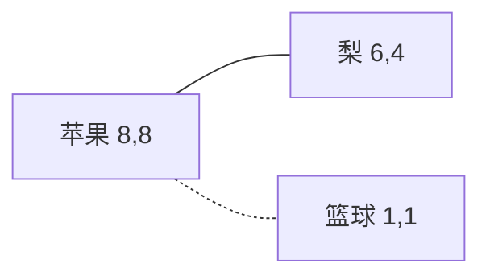
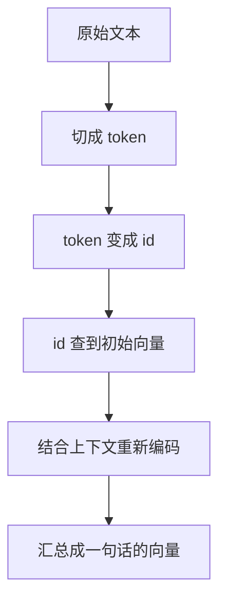
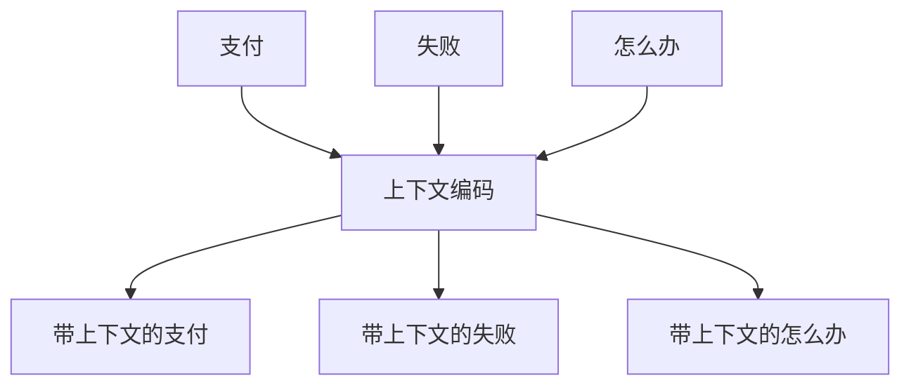
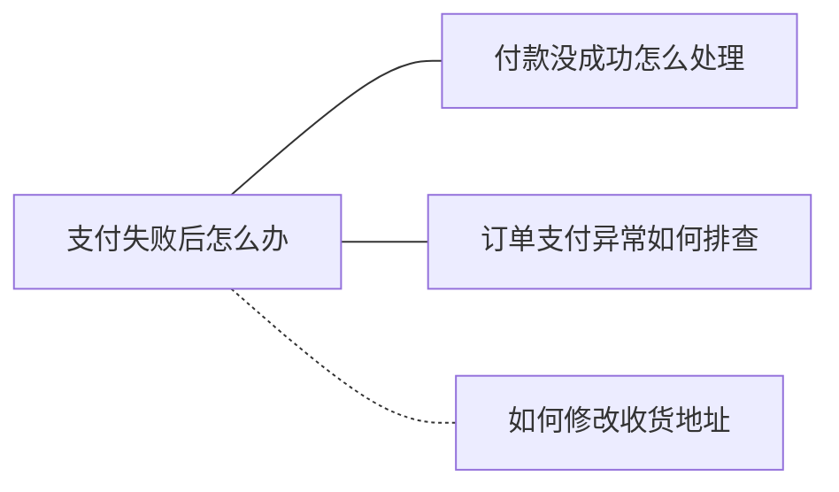
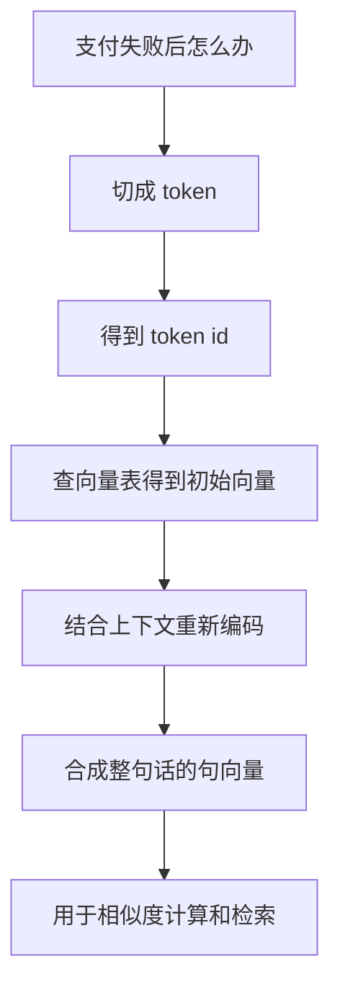
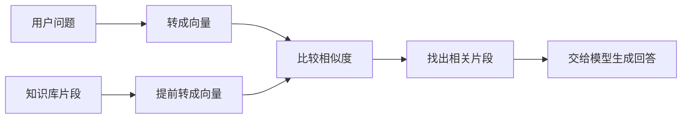

# 大模型学习笔记 06：Embedding：文本如何变成向量

前面讲 Token 时，先把一个基础问题想清楚了：模型不是直接“看懂一整段文字”，而是先把文字拆成一个个 token，再把这些 token 交给模型处理。

但新的问题马上来了：

> token 只是编号。编号本身没有语义，那模型到底怎么从这些编号里理解“付款失败”和“支付没成功”很像？

这就是 Embedding 要解决的问题。

可以先用一句话抓住它：

> Embedding 是把文本变成一组有语义关系的数字坐标，让计算机可以比较“意思像不像”。

这里的关键词不是“数字”，而是“关系”。  
如果只是随便给一句话编一串数字，那没有任何价值。Embedding 真正有用，是因为它希望做到：意思接近的文本，变成的向量也接近。

## 这一篇先学什么

| 问题 | 这一篇要讲清楚什么 |
| --- | --- |
| 为什么需要向量 | 计算机为什么不能直接比较文本含义 |
| 向量是什么 | 怎么把一句话理解成意义地图上的坐标 |
| 文本怎么变向量 | 从 token 到向量的大致流程 |
| 语义为什么能靠近 | 模型为什么会学到“意思近就放得近” |
| 代码在做什么 | `encode()` 背后不是简单字符串转换 |
| 工程里怎么用 | 搜索、分类、聚类、推荐为什么都依赖它 |
| 边界在哪里 | 为什么向量相似不等于一定正确 |

## 先用一个生活化例子理解“向量”

先别急着想大模型，先看一个简单例子。

假设只用两个数字描述水果：

- 第一个数字表示甜度
- 第二个数字表示脆度

那么可以这样写：

| 物品 | 甜度 | 脆度 | 向量 |
| --- | ---: | ---: | --- |
| 苹果 | 8 | 8 | `(8, 8)` |
| 梨 | 6 | 4 | `(6, 4)` |
| 篮球 | 1 | 1 | `(1, 1)` |

这时 `(8, 8)`、`(6, 4)`、`(1, 1)` 就是三个二维向量。

苹果和梨更接近，因为它们都和“水果、甜、可食用”有关。  
篮球离它们远，因为它不属于这个语义范围。



这个例子虽然简单，但已经抓住了 Embedding 的核心直觉：

> 向量不是为了把东西变复杂，而是为了让“相似”和“不相似”变得可以计算。

真实文本当然不可能只用“甜度、脆度”两个维度描述。  
一句话里可能包含主题、情绪、动作、对象、场景、领域、语气、上下文等很多特征，所以真实模型会用几百甚至几千个数字来表示一段文本。

这就是高维向量。

## 文本为什么不能直接比较

人看下面两句话，会觉得它们很接近：

```text
付款失败后怎么办
支付没成功怎么处理
```

但如果程序只按字符串看，它们其实差别很大：

- “付款”和“支付”不是同一个词
- “失败”和“没成功”不是同一种写法
- “怎么办”和“怎么处理”也不是完全一样的字符

关键词匹配可以解决一部分问题，但它很容易漏掉同义表达。

再看一个客服场景：

```text
用户 A：提交订单后一直卡住
用户 B：支付页面没有响应
用户 C：如何修改收货地址
```

人能看出 A 和 B 可能都和交易流程异常有关，C 是另一个问题。  
Embedding 的目标，就是让系统也能有这种“相近感”。

它不是让模型像人一样真正体验语义，而是把语义关系转成数学空间里的位置关系。

## 从文本到向量，大致经历哪几步

把一句话变成向量，可以先看成 5 步。



用一句话概括：

```text
文本 -> token -> token id -> token 向量 -> 上下文化向量 -> 句向量
```

这条链路很重要。  
如果只写成：

```text
文本 -> 向量
```

中间真正关键的部分就都被遮住了。

下面一层一层拆开。

## 第一步：文本先被切成 token

比如：

```text
支付失败后怎么办
```

进入模型前，它通常会先被分词器切开。  
切法不一定等于人类理解里的“词”，可能是字、词，也可能是子词片段。

切完以后，每个 token 会被映射成一个整数 id。

可以先用示意理解：

| token | token id |
| --- | ---: |
| 支付 | 18342 |
| 失败 | 29108 |
| 后 | 519 |
| 怎么办 | 76231 |

这些 id 不是语义本身，只是模型词表里的编号。  
就像商品条形码一样，条形码本身不是商品，但系统可以通过它找到商品信息。

所以到这一步为止，模型还没有真正得到“语义向量”，只是把文本变成了可查找的编号。

## 第二步：token id 查到初始向量

下一步，模型会拿 token id 去查一张向量表。

可以把这张表想成一个很大的字典：

| token id | 初始向量 |
| --- | --- |
| 18342 | `[0.12, -0.08, 0.33, ...]` |
| 29108 | `[-0.03, 0.44, 0.19, ...]` |
| 519 | `[0.51, 0.07, -0.26, ...]` |

也就是说：

```text
token id -> 查表 -> 初始向量
```

如果用公式写，就是：

$$
e_i=E[t_i]
$$

这个公式只是在表达“查表”：

- $t_i$ 表示第 $i$ 个 token 的编号
- $E$ 表示模型里的向量表
- $e_i$ 表示查出来的初始向量

如果公式看起来费劲，可以先忽略它。  
这一步的人话意思就是：

> 模型先把每个 token 编号，换成一串能参与计算的数字。

注意，这里的“初始向量”还不是最终语义。  
它更像一个词的基础材料，后面还要结合上下文继续加工。

## 第三步：上下文会改变 token 的含义

如果每个 token 只查一次表，那就会有一个大问题：同一个词在不同句子里可能意思不同。

比如“苹果”：

```text
我买了一个苹果
苹果系统更新了
```

第一句里的“苹果”更像水果。  
第二句里的“苹果”更像公司或操作系统。

如果模型只给“苹果”一个固定向量，就没法区分这两种意思。  
所以现代 Embedding 模型通常会继续做上下文编码：让一个 token 的表示，不只看自己，也看周围的词。

可以把它理解成开会：

- 每个 token 一开始只带着自己的基础信息
- 进入模型后，它会“听”其他 token 在说什么
- 多轮交互后，每个 token 都带上了整句话的上下文



这一步通常由深度学习模型完成，常见结构包括 Transformer 一类编码器。  
入门阶段不用急着追所有细节，先抓住一点：

> 向量不是只表示单个词，还会被上下文重新塑形。

这也是为什么“支付失败”和“付款没成功”有机会靠近。  
模型不是只看字面，而是在训练中学到了这些表达经常出现在相似语境里。

## 第四步：一堆 token 向量要合成一句话的向量

经过上下文编码后，一句话里的每个 token 都有了自己的向量。  
但实际做搜索时，我们通常不希望一条文本输出很多个向量，而是希望整句话有一个整体向量。

比如：

```text
支付失败后怎么办
```

我们希望它最后变成类似这样的一串数字：

```text
[0.018, -0.204, 0.771, ...]
```

这个整体向量就可以理解成这句话在“语义地图”上的坐标。

那怎么把多个 token 向量合成一个句向量？  
常见方式有很多，入门阶段先看最容易理解的：平均池化。

假设一句话只有 3 个 token，而且每个 token 只用 2 个数字表示：

| token | 向量 |
| --- | --- |
| 支付 | `[1, 2]` |
| 失败 | `[3, 4]` |
| 怎么办 | `[5, 6]` |

对每一列求平均：

```text
第 1 维：(1 + 3 + 5) / 3 = 3
第 2 维：(2 + 4 + 6) / 3 = 4
```

最后得到整句话的向量：

```text
[3, 4]
```

如果用公式写：

$$
s=\frac{1}{n}\sum_{i=1}^{n}h_i
$$

其中：

- $h_i$ 表示第 $i$ 个 token 的上下文向量
- $n$ 表示 token 数量
- $s$ 表示合成后的句向量

这个公式的意思就是“把多个 token 向量平均成一个整体向量”。  
真实模型的合成方式可能更复杂，但这个例子足够帮助入门理解：**句向量不是凭空来的，而是从 token 表示汇总出来的。**

## 第五步：为什么意思相近的文本会靠近

到这里，还剩一个最关键的问题：

```text
为什么模型生成出来的向量不是乱的？
为什么它知道“付款失败”和“支付没成功”应该接近？
```

答案在训练里。

模型不是人工一条条规定“这个词和那个词相似”，而是在大量文本中学习规律。  
训练时，它会不断遇到类似这样的语言现象：

```text
支付失败后怎么办
付款没成功怎么处理
订单支付异常如何排查
```

这些句子经常出现在相似场景里，表达的任务也接近。  
模型经过大量训练后，会逐渐把它们放到比较接近的位置。

反过来，下面这句话就应该离它们远一些：

```text
如何修改收货地址
```

因为它虽然也可能出现在电商客服里，但具体语义不一样。



更进一步说，很多 Embedding 模型会通过“拉近相似文本、拉远不相似文本”的方式训练。

先不用急着记损失函数，先记住这个训练方向：

```text
相似表达 -> 向量更近
无关表达 -> 向量更远
反复训练 -> 形成语义空间
```

如果想用一个公式辅助理解，可以看下面这个简化版本：

$$
L=\max(0,m+d(a,p)-d(a,n))
$$

它表达的是：

- $a$ 是锚点文本，比如“支付失败后怎么办”
- $p$ 是相似文本，比如“付款没成功怎么处理”
- $n$ 是不相似文本，比如“如何修改收货地址”
- $d(a,p)$ 是锚点和相似文本的距离
- $d(a,n)$ 是锚点和不相似文本的距离
- $m$ 是希望拉开的安全间隔

这段公式可以先当作可选内容。  
对入门读者来说，真正重要的是这句话：

> 模型通过大量训练，把经常表达相似含义的文本放近，把不相关的文本拉远。

## 一个完整例子：一句话怎么走完这条链路

把前面的内容合起来，看一句话：

```text
支付失败后怎么办
```

它大致经历这样的过程：



如果知识库里还有几句话：

```text
1. 付款没成功怎么处理
2. 订单支付异常如何排查
3. 怎么修改收货地址
```

系统可以先把它们都转成向量。  
之后用户搜索“支付失败后怎么办”时，就不再只看关键词，而是比较向量之间谁更接近。

这就是语义搜索的基础。

## 一段代码到底做了什么

很多示例会这样写：

```python
from sentence_transformers import SentenceTransformer

model = SentenceTransformer("sentence-transformers/all-MiniLM-L6-v2")

texts = [
    "支付失败后怎么办",
    "付款没成功怎么处理",
    "如何修改收货地址",
]

vectors = model.encode(texts, normalize_embeddings=True)
print(vectors.shape)
```

这段代码真正做的不是“把字符串变数组”这么简单。

它背后大概做了这些事：

| 代码表面 | 背后发生的事 |
| --- | --- |
| `model.encode(texts)` | 分词、查向量表、上下文编码、合成句向量 |
| `vectors` | 每条文本对应一个固定长度向量 |
| `normalize_embeddings=True` | 把向量长度处理到更适合相似度比较 |
| `vectors.shape` | 查看生成了多少条向量，每条向量有多少维 |

比如 `all-MiniLM-L6-v2` 这类轻量句向量模型，常见输出是 384 维。  
这意味着一段文本会被表示成 384 个数字。

看起来很多，但对计算机来说刚刚好：  
它可以快速保存、比较、排序、检索。

## Embedding 和聊天模型不是同一个任务

这里也容易混。

聊天模型通常做的是：

```text
输入一段话 -> 生成一段回答
```

Embedding 模型做的是：

```text
输入一段话 -> 输出一个向量
```

两者都可能基于深度学习，也都可能理解文本，但目标不同。

| 类型 | 输入 | 输出 | 适合做什么 |
| --- | --- | --- | --- |
| 聊天模型 | 文本、图片等 | 一段回答 | 对话、总结、生成、推理 |
| Embedding 模型 | 文本 | 向量 | 搜索、聚类、分类、推荐 |

所以不要把 Embedding 当成“不会说话的聊天模型”。  
它更像是一个语义编码器：不负责回答问题，只负责把文本变成可比较的坐标。

## 向量维度到底是什么

Embedding 输出通常不是 2 个数字，而是几百或几千个数字。

可以把维度理解成“描述文本的角度数量”。

二维水果例子里，只有：

- 甜度
- 脆度

但文本复杂得多，可能包含：

- 主题
- 行为
- 对象
- 情绪
- 领域
- 语气
- 上下文
- 任务意图

真实模型不会把每一维直接命名成“情绪维”“主题维”，它们是训练中形成的综合特征。  
所以不要把每个数字强行解释成某个固定含义。

更稳的理解是：

> 单个维度不一定好解释，但整组数字一起，可以表达文本在语义空间里的位置。

## 在工程里，Embedding 常用来做什么

只要文本变成向量，就可以进入很多工程场景。

### 语义搜索

用户搜：

```text
支付一直失败怎么办
```

系统能找到：

```text
付款异常排查指南
订单支付超时处理流程
```

即使关键词不完全一样，也有机会被召回。

### 用户反馈分类

一堆用户反馈：

```text
页面一直转圈
支付按钮没反应
订单没有生成
优惠券不能用
```

转成向量后，可以把相似反馈聚到一起，帮助产品或研发看到问题分布。

### 知识库问答

后面做文档问答时，常见流程是：



这里先不展开整套问答系统，只抓住一点：  
Embedding 是检索前的表示层。没有它，系统很难按语义找资料。

## 什么时候不要把 Embedding 想得太神

Embedding 很有用，但它不是万能理解器。

| 场景 | 为什么要小心 |
| --- | --- |
| 金额、日期、数量判断 | 语义相似不等于数值正确 |
| 权限、合规、合同条款 | 不能只靠相似度做最终决策 |
| 很短的文本 | 信息太少，向量可能不稳定 |
| 领域术语很多 | 通用模型未必懂业务内部表达 |
| 文本太长太杂 | 一个向量可能装不下所有重点 |

比如：

```text
退款金额是 100 元
退款金额不是 100 元
```

这两句话字面很像，向量也可能接近。  
但它们的业务含义完全相反。

所以 Embedding 更适合做“召回”和“初步匹配”，不适合单独承担最终判断。

## 这篇可以先收束成三个理解

第一，Embedding 不是简单把文本翻译成数字，而是把文本放到一个语义空间里。数字真正有价值的地方，是它们之间的位置关系。

第二，文本变向量大致经历“token 化、查向量表、上下文编码、合成句向量”这条链路。代码里的 `encode()` 只是把这条链路封装起来了。

第三，Embedding 的工程意义是让文本可以被比较。后面再看相似度、向量数据库和文档问答时，本质上都是在利用这件事：先把文字变成坐标，再用数学方法找出语义上更接近的内容。

## 参考资料

- [Sentence Transformers: all-MiniLM-L6-v2](https://huggingface.co/sentence-transformers/all-MiniLM-L6-v2)
- [OpenAI Embeddings API 示例](https://developers.openai.com/api/docs/guides/embeddings)
