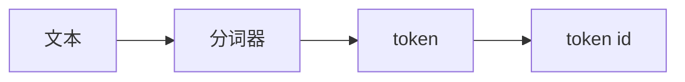
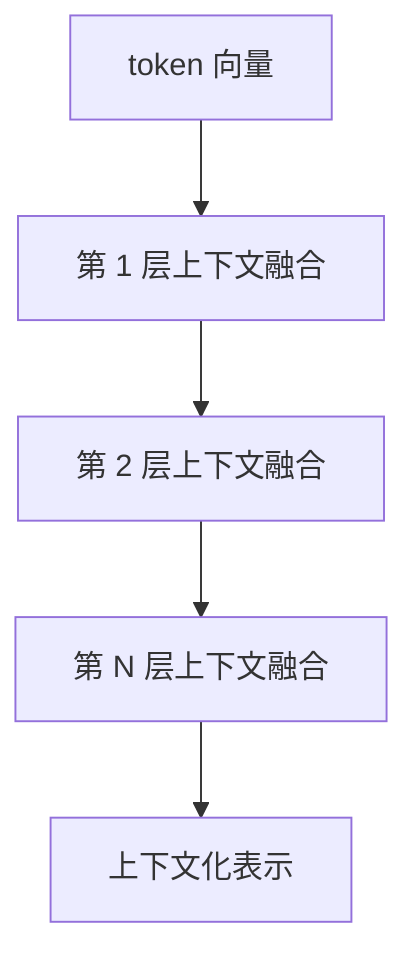
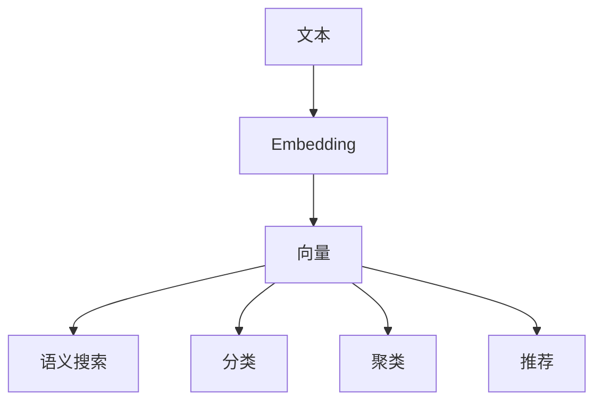

# 大模型学习笔记 06：Embedding：文本如何变成向量

前一篇我们把 `Token` 这件事讲清楚了：模型不是直接“看整段文字”，而是先把输入拆成更小的单位，再去处理。

这一篇就是顺着这个问题继续往下走：

> token 只是模型读文本的基本单位，那么这些 token 是怎么进一步变成“可比较、可检索、可计算”的向量的？

如果只看一行代码，Embedding 很容易被误解成“把文本扔进模型，直接吐出一串数字”。  
但真实过程并不这么简单。

它本质上是一套**表示学习**流程：先把文本切成 token，再把 token 映射成向量，再借助深度学习把上下文信息揉进去，最后压成一个固定长度的语义表示。

换句话说，Embedding 不是“翻译成数字”这么浅，而是把离散文本变成连续空间里的可计算对象。

这一步正好把前面的 `Token` 和后面的 `相似度 / 检索 / RAG` 接起来：  
前面解决“模型怎么读”，这一篇解决“读完之后怎么表示”。

## 这一篇先学什么

| 学习点 | 要解决什么 |
| --- | --- |
| 文本为什么不能直接算 | 为什么程序不擅长直接理解字符串 |
| token 化 | 文本是怎么先被拆开的 |
| 向量表 | 一个词/Token 为什么会对应一个向量 |
| 上下文编码 | 为什么同一个词在不同句子里会变 |
| 句向量 | 为什么最后要压成固定长度 |
| 训练目标 | 模型为什么会学会“相近语义更近” |
| 工程意义 | 这些向量到底怎么被用起来 |

## 先把误解说清楚

很多人第一次接触 Embedding 时，会把它想成：

```text
文本 -> 一次性编码 -> 向量
```

这个理解太粗了。

更接近真实情况的是下面这条链路：


也就是说，真正复杂的地方，不在“输出一串数字”这件事本身，而在于：  
**模型怎样把文本里的语义关系，压进这一串数字里。**

## 这一章和前后内容怎么接

如果把这一系列文章当成一条线来看，关系其实很清楚：

| 前后章节 | 解决什么 |
| --- | --- |
| 第 5 章 Token | 模型怎么把文本拆成能处理的单位 |
| 第 6 章 Embedding | 模型怎么把这些单位组织成语义向量 |
| 第 7 章 余弦相似度 | 向量之间怎么比较像不像 |
| 第 8 章 文本切分 | 长文档怎么切成适合向量化的片段 |
| 第 9 章 向量数据库 | 这些向量怎么存、怎么找 |

所以这一篇不是孤立的“一个技术点”，而是承上启下的一环。  
它往前接的是 token，往后接的是相似度和检索。

换句话说：

- 上一章解决的是“模型怎么把输入切开、看懂”
- 这一章解决的是“看懂之后，怎么把文本组织成可比较的向量”
- 下一章解决的是“这些向量到底怎么比，才能找出最像的内容”

## 为什么文本不能直接给程序用

文本对人来说是意思，对程序来说只是符号。

比如这三句：

- `付款失败`
- `支付未成功`
- `订单没生成`

人能看出前两句更像，第三句稍微远一点。  
但程序如果只看字符，不会天然知道谁和谁更接近。

最原始的做法是 one-hot 或词袋表示：

- 词是词
- 位置是位置
- 语义关系几乎没有

这类表示的问题很明显：

- 维度高
- 稀疏
- 词与词之间没有“接近”的概念
- 没法自然表达同义改写

所以 Embedding 的第一步，就是把这种离散符号，换成连续向量。

## 第一步：先把文本切成 token

在进入模型之前，文本通常会先被切成 token。

token 可以粗略理解成：

- 一个字
- 一个词
- 一个子词片段

具体怎么切，取决于模型的分词器。

例如：

```text
支付失败后怎么办
```

可能会被切成几段 token。  
切法不一定完全按“词”来，它更像是在兼顾词义覆盖和词表规模。

这一层的作用是：

1. 把连续文本拆成可处理的单位
2. 映射到词表里的整数 id
3. 为后续查表和编码做准备



## 第二步：token id 先查一张向量表

每个 token id 都能查到一条初始向量。  
这一步可以理解成“查表”。

可以把它写成：

$$
e_i = E[t_i]
$$

其中：

- `$t_i$` 表示第 `$i$` 个 token 的 id
- `$E$` 表示模型里的向量表
- `$e_i$` 表示查出来的初始向量

更形象一点，`E` 就像一个超大的字典：

- 输入一个 id
- 输出一个向量

这个向量不是最终答案，只是起点。  
它的作用是让 token 从“整数编号”变成“可参与计算的连续表示”。

## 第三步：上下文让向量真正变得有意义

如果只做查表，每个 token 的向量还是“静态”的。  
但语义真正复杂的地方，往往在上下文里。

比如“苹果”：

- `我买了一个苹果`
- `苹果系统更新了`

同一个词，在不同句子里的意思完全不同。  
模型必须把上下文也算进去，才能得到更像样的表示。

这就是深度学习编码器要做的事。

### 它大概怎么做

以 Transformer 一类编码器为例，模型会让每个 token 和其他 token 交互，逐层更新表示。  
粗略看，可以理解成：

- 第 1 层先看邻近信息
- 后面几层逐渐融合更远的上下文
- 最终每个 token 的表示，都带上整句语义



所以 Embedding 的关键，不是“查到一个静态词向量”，而是：

> 让 token 的表示在上下文中被重新塑形。

## 为什么最后还要压成固定长度

一段文本里可以有很多 token，但向量检索系统更希望输入长度固定。

所以模型通常会把整段文本的 token 表示，汇总成一个句向量或文档向量。

常见方式有三种：

| 方法 | 做法 | 特点 |
| --- | --- | --- |
| Mean Pooling | 对所有 token 向量取平均 | 稳定，常见 |
| CLS Pooling | 取特殊标记的表示 | 简单，依赖训练方式 |
| Max Pooling | 每个维度取最大值 | 更强调突出特征 |

如果用平均池化，可以写成：

$$
s=\frac{1}{n}\sum_{i=1}^{n} h_i
$$

其中：

- `$h_i$` 表示第 `$i$` 个 token 的上下文化向量
- `$n$` 表示 token 数量
- `$s$` 表示最终句向量

这一步的意义是把一串 token 的信息，压缩成一个整体表示。  
这样后面才能拿它去算相似度、做搜索、做聚类。

## 模型到底是怎么学会“意思接近就靠近”的

这里才是 Embedding 真正的学习核心。

它不是人工规定“这两个词应该近一点”，而是通过训练目标自己学出来的。

最常见的思想是：

- 相似文本作为正样本
- 不相关文本作为负样本
- 训练模型让正样本更近，负样本更远

可以用一个很简化的三元组思路理解：

$$
L=\max(0, m + d(a,p) - d(a,n))
$$

其中：

- `$a$` 表示锚点文本
- `$p$` 表示正样本文本
- `$n$` 表示负样本文本
- `$d(\cdot)$` 表示距离
- `$m$` 表示间隔
- `$L$` 表示损失

它想表达的意思很朴素：

> 让锚点和正样本更近，和负样本更远，而且要拉开一定间隔。

这就是深度学习在这里真正发挥作用的地方。  
模型不是被“告知”语义是什么，而是在大量样本里，把这种空间关系学出来。

## 一个完整例子：支付失败怎么变成向量

看句子：

```text
支付失败后怎么办
```

大致会经历这样的过程：

1. 分词器把句子切成 token
2. token id 查到初始向量
3. 编码器把“支付”“失败”“怎么办”之间的关系融合进去
4. 池化层把整句汇总成一个固定长度的句向量
5. 归一化后得到最终 Embedding

如果另一句是：

```text
付款没成功怎么处理
```

它们经过编码后，向量方向通常会更接近。  
这就是后面语义搜索、相似问答、文档召回能工作的基础。

如果把它和上一章连起来看，逻辑会更顺：

1. 上一章先知道模型读的是 token，不是整句魔法。
2. 这一章再看 token 如何被编码成向量。
3. 下一章再看向量之间如何比较远近。

## 一段代码为什么不够说明问题

很多示例只会给出这样一段代码：

```python
from sentence_transformers import SentenceTransformer

model = SentenceTransformer("sentence-transformers/all-MiniLM-L6-v2")
vectors = model.encode([
    "订单提交后一直转圈",
    "支付页面没有响应",
], normalize_embeddings=True)
```

这段代码只能说明“怎么调用”，不能说明“为什么能这样算”。

真正需要理解的是：

- `encode()` 背后不是简单字符串转换
- 模型内部有 tokenization、编码层、池化层
- 训练时已经学好了语义空间
- 输出向量只是整个过程的结果

所以，代码应该放在理解之后，而不是理解之前。

## Embedding 不是压缩，是重表示

这点非常关键。

它不是把一句话“缩短”成一串数字，  
而是把一句话从“人类符号空间”搬到“机器可计算空间”。

| 原始文本 | Embedding |
| --- | --- |
| 离散符号 | 连续向量 |
| 适合人读 | 适合机器算 |
| 无法直接比较语义 | 可以比较相似度 |

所以 Embedding 的价值不是“看起来高级”，而是让程序第一次能比较语义。

## 它和大模型聊天能力有什么不同

这个也很容易混。

聊天模型更像是在做：

- 理解输入
- 生成输出
- 按上下文续写答案

Embedding 模型更像是在做：

- 提取表示
- 保留语义关系
- 输出一个稳定向量

两者都可能用到深度学习和 Transformer，但目标不同：

| 类型 | 核心目标 |
| --- | --- |
| 生成模型 | 生成下一段内容 |
| Embedding 模型 | 生成可比较的表示 |

所以不要把 Embedding 当成“另一个聊天接口”。  
它更像一台把文本转成坐标的机器。

## 在工程里，这个向量能做什么

一旦文本变成向量，很多能力就自然出现了：

- 语义搜索
- 文档问答
- FAQ 匹配
- 工单聚类
- 意图分类
- 推荐召回

这些能力的共同前提都是：

> 先让文本在同一个语义空间里可比较。



## 什么时候别把它想得太神

Embedding 很强，但它不是“理解真相”。

它有几个边界：

| 问题 | 原因 |
| --- | --- |
| 严格规则判断 | 相似度不等于正确性 |
| 实时事实判断 | 向量不自动更新世界状态 |
| 复杂逻辑推理 | 它更擅长表示，不擅长裁决 |
| 极短文本 | 信息太少，表示不稳定 |
| 领域术语特别多 | 需要更好的领域训练或微调 |

所以它通常是第一层表示能力，不是最后的业务结论。

## 这篇可以先收束成一句话

Embedding 不是把文本随手变成一个数字，而是通过 token 化、上下文编码、池化和训练目标，把文本映射成一个能表达语义关系的向量。

理解了这条链路，下一篇再看余弦相似度，就不是在看一个孤立公式，而是在看“向量该怎么比较”。

## 参考资料

- [OpenAI Embeddings API 示例](https://developers.openai.com/api/docs/guides/embeddings)
- [开源句向量模型示例：all-MiniLM-L6-v2](https://huggingface.co/sentence-transformers/all-MiniLM-L6-v2)
