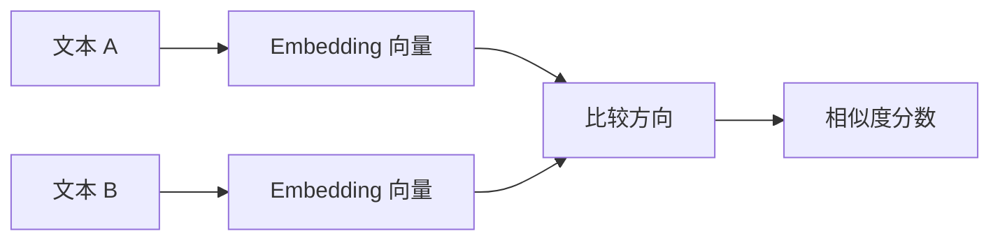
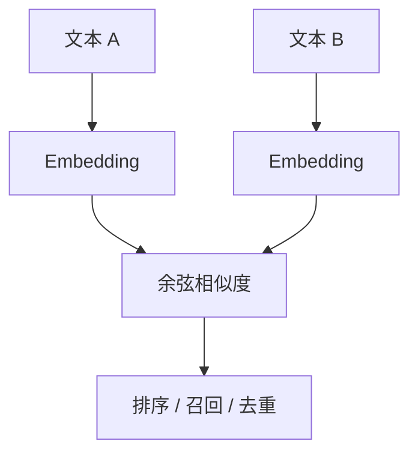
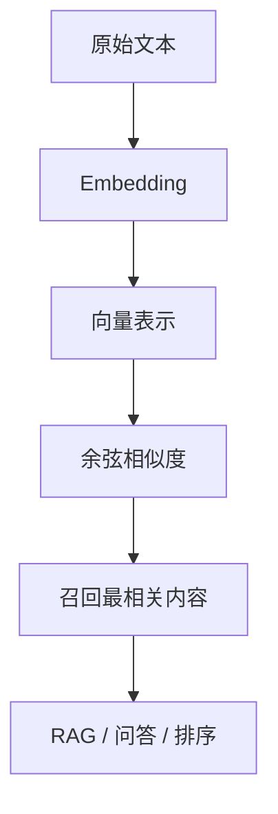

# 大模型学习笔记 07：余弦相似度：如何判断两段文本像不像

Embedding 把文本放进了一个向量空间，但这还只是第一步。  
真正的问题是：**两段文本对应的向量，怎么判断“像不像”**？

向量出来以后，下一步自然就是比较。先有表示，再有比较，这条线连起来以后，语义搜索才真正开始变得可实现。

这就是余弦相似度要解决的事。

它看起来只是一个公式，但背后其实是在回答一个很现实的问题：

> 当文本已经变成向量以后，程序应该按什么标准去比较它们的语义接近程度？

所以这一篇不是从零开始讲一个新概念，而是站在上一章的结果上继续往下走。  
如果说第 6 章解决的是“怎么把文本变成向量”，那这一章就是在回答“向量怎么比较”。

## 这一篇先学什么

| 学习点 | 这一篇要讲清楚什么 |
| --- | --- |
| 余弦相似度 | 它到底在比较什么 |
| 方向和长度 | 为什么看角度比看长度更关键 |
| 数学公式 | 每个符号分别表示什么 |
| 数字例子 | 怎么把公式真正算一遍 |
| 语义空间 | 为什么它适合 Embedding 向量 |
| 工程场景 | 它怎么用于搜索、去重、排序 |
| 使用边界 | 什么时候不能只靠它判断 |

## 最容易混淆的地方

很多人第一次接触相似度时，会下意识以为：

```text
两个向量越长，就越相似。
```

这其实不对。

在 Embedding 场景里，长度往往不是最重要的信息，**方向才更关键**。  
原因很简单：我们更关心两段文本表达的语义是否接近，而不是它们数值总和是不是差不多。

比如：

- `付款失败`
- `支付未成功`

这两句话的意思很接近，向量方向也通常更接近。  
而一段很长的无关描述，即使某些维度数值更大，也不代表更像。



## 余弦相似度到底在比什么

余弦相似度比较的是两个向量之间夹角的余弦值。  
直觉上，它问的是：

> 这两个向量是不是朝着差不多的方向？

如果方向很接近，说明语义上往往更接近。  
如果方向差很多，说明相关性通常更弱。

它常写成：

$$
\cos(\theta)=\frac{A\cdot B}{\|A\|\|B\|}
$$

其中：

- `$A$` 和 `$B$` 表示两个向量
- `$A \cdot B$` 表示点积
- `$\|A\|$` 和 `$\|B\|$` 表示向量长度
- `$\theta$` 是两个向量之间的夹角

结果通常落在 `-1 \sim 1` 之间。

在文本语义场景里，如果向量经过了常见归一化处理，结果通常更常见于 `0 \sim 1` 附近。  
值越大，一般表示越相似。

## 为什么看方向比看长度更合理

可以先把向量想成地图上的箭头：

- 箭头指向哪里，代表语义往哪个方向走
- 箭头有多长，代表数值大小

但在文本相似度里，长度经常带有一些“附加因素”：

- 文本长度
- 模型输出尺度
- 是否做了归一化
- 不同模型的分布差异

所以如果只看长度，很容易把“更长”误认为“更像”。  
而余弦相似度尽量忽略长度，只关心方向。

这也是它特别适合语义搜索的原因。  
我们通常不是想知道两段文本“数值上离得近不近”，而是想知道它们“意思上像不像”。

也正因为这样，余弦相似度和上一章的 Embedding 是绑定在一起看的：  
Embedding 负责把语义压成向量，余弦相似度负责把向量里的语义距离读出来。

## 先看一个二维例子

假设有两个向量：

$$
A=(1,0)
$$

$$
B=(1,1)
$$

先算点积：

$$
A\cdot B = 1\times1 + 0\times1 = 1
$$

再算长度：

$$
\|A\| = \sqrt{1^2+0^2}=1
$$

$$
\|B\| = \sqrt{1^2+1^2}=\sqrt{2}
$$

代回公式：

$$
\cos(\theta)=\frac{1}{1\times\sqrt{2}}\approx0.707
$$

这代表什么？

- 两个向量不是完全同向
- 但方向已经比较接近
- 在语义场景里，通常可以理解为“有相关性，但不是完全一样”

再看一个更接近的情况：

$$
C=(2,0)
$$

它和 `$A=(1,0)$` 方向完全一致。  
即使长度不同，余弦相似度仍然是 1。

这正好说明：**余弦相似度看的是方向，不是大小。**

## 它和点积、欧氏距离有什么区别

这几个概念很容易混在一起。

| 度量方式 | 更关注什么 | 适合什么场景 |
| --- | --- | --- |
| 点积 | 方向和长度共同影响 | 向量已归一化或模型直接训练为内积空间 |
| 余弦相似度 | 方向是否接近 | 语义相似、文本检索 |
| 欧氏距离 | 两个点实际相隔多远 | 几何距离、聚类、某些特征空间 |

如果向量没有归一化，点积会同时受到方向和长度影响。  
余弦相似度则更像是在说：

> 先把长度因素尽量拿掉，再专心比较方向。

这也是它在文本任务里更常见的原因。

## 为什么它适合 Embedding

Embedding 的目标，是把“意思接近”的文本放得更近。  
那么相似度函数就需要能识别这种“近”。

余弦相似度正好可以把这个问题变成一个几何问题：

- 文本 A 和文本 B 的向量方向越接近，相似度越高
- 方向越不一致，相似度越低



于是，原本只能靠人工判断的“像不像”，就可以交给程序批量处理。

## 一个更贴近工程的例子

假设知识库里有三段内容：

1. `支付失败后如何处理`
2. `订单支付超时排查`
3. `如何修改收货地址`

用户查询的是：

```text
支付没成功怎么办
```

Embedding 后，程序会把查询向量和三段内容向量分别算余弦相似度。  
理想情况下：

- 第 1 条分数最高
- 第 2 条次高
- 第 3 条明显更低

这样系统就能把最相关的内容先返回。

这也是语义搜索、FAQ 检索、RAG 召回里非常常见的一步。

## 余弦相似度不是“语义真理”

这一点很重要。

余弦相似度高，不代表两段文本完全等价。  
它只是表示：**在当前向量空间里，它们比较接近。**

所以它有几个边界：

| 问题 | 为什么不能只靠它 |
| --- | --- |
| 严格数值判断 | 语义像不等于数值对 |
| 强规则判断 | 合规、权限、金额不能只看相似度 |
| 细粒度逻辑推理 | 相似度不负责判断因果和真假 |
| 极短文本 | 信息太少，向量容易不稳定 |
| 领域术语很多 | 如果模型没学好，方向也未必准 |

换句话说，余弦相似度很适合做“第一轮筛选”，但不适合单独承担最终裁决。

## 和后续 RAG 的关系

学到这里，其实已经能看清一条很清晰的链路了：



Embedding 负责“变成能比较的形式”。  
余弦相似度负责“比较像不像”。  
后面的检索、召回、排序，才有了可以落地的基础。

而再往后看第 8 章文本切分，这个相似度又会反过来要求输入片段不能太长、不能太散。  
也就是说，从 token 到 embedding，到相似度，再到切分和检索，这条链路其实是一环扣一环的。

## 可以先记住的结论

这一篇最值得记住的，不是公式本身，而是下面这句话：

> 余弦相似度本质上是在比较两个向量的方向，而语义检索正需要这种“忽略长度、强调方向”的比较方式。

理解了这一点，后面再看向量数据库、检索召回、RAG 排序，就不会觉得它们是零散概念了。  
它们其实是在同一条链路上，分别解决“表示”“比较”“检索”这三个问题。


