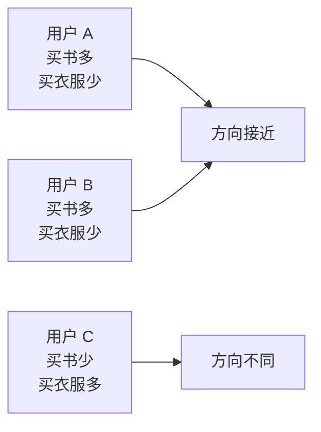
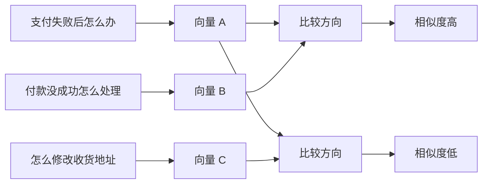
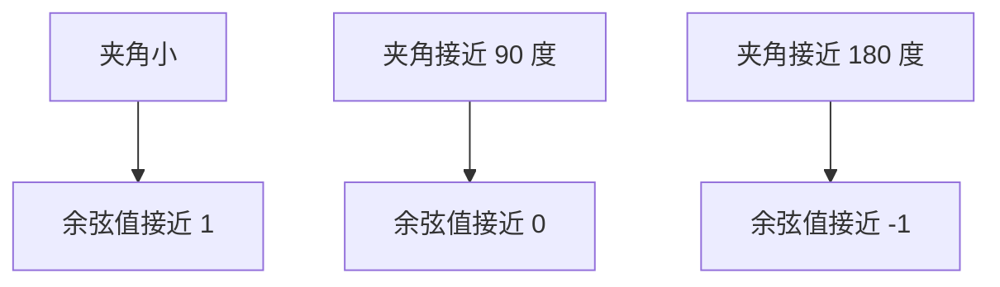
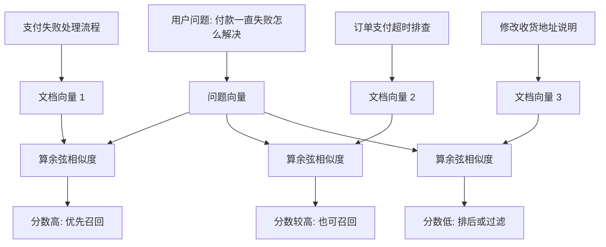
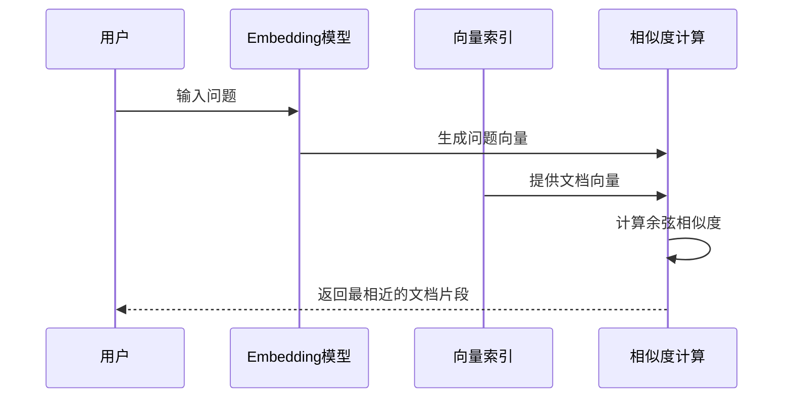
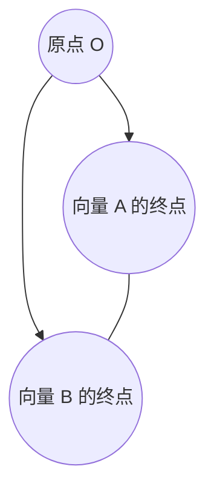

# 大模型学习笔记 07：余弦相似度：如何判断两段文本像不像

上一篇把 Embedding 讲到一个关键位置：文本可以被模型编码成一组数字，也就是向量。

但向量只是“表示出来了”。真正进入检索、推荐、去重、聚类这些场景时，还要继续回答一个问题：

> 有了两个向量以后，怎么判断它们代表的文本到底像不像？

这就是余弦相似度要解决的问题。

可以先用一句话抓住它：

> 余弦相似度不是比较两个向量有多长，而是比较两个向量朝向是否接近。

这句话很重要。因为在文本语义里，很多时候我们关心的不是一句话“规模大不大”，而是它表达的方向是不是一致。

比如：

```text
支付失败后怎么办
付款没成功怎么处理
```

这两句话字面不完全一样，但问题方向很接近。  
再比如：

```text
支付失败后怎么办
如何修改收货地址
```

这两句话都可能出现在电商系统里，但要解决的问题明显不同。

Embedding 负责把文本变成向量，余弦相似度负责在这些向量之间做比较。一个偏“表示”，一个偏“判断”。把这两个概念接起来，语义检索这条链路才真正开始变得清楚。

## 这一篇先学什么

| 问题 | 这一篇要讲清楚什么 |
| --- | --- |
| 为什么要比较向量 | 文本变成向量以后，为什么还需要一个相似度分数 |
| 为什么看方向 | 为什么余弦相似度更关注方向，而不是长度 |
| 余弦是什么 | 夹角、余弦值和“方向相似”之间有什么关系 |
| 点积是什么 | 点积为什么能反映两个向量是否同向 |
| 模长是什么 | 向量长度怎么计算，为什么公式里要除以长度 |
| 公式怎么读 | 余弦相似度公式每一部分在表达什么 |
| 怎么手算一次 | 用很小的二维向量把结果算出来 |
| 工程里怎么用 | 它在语义搜索、推荐、去重里怎么落地 |
| 边界在哪里 | 为什么分数高不代表语义一定完全正确 |

## 先从一个不需要公式的例子开始

假设要比较三个用户的消费偏好，只看两个维度：

- 买书数量
- 买衣服数量

可以得到这样一张表：

| 用户 | 买书 | 买衣服 | 向量表示 |
| --- | ---: | ---: | --- |
| 用户 A | 100 | 2 | `(100, 2)` |
| 用户 B | 50 | 1 | `(50, 1)` |
| 用户 C | 2 | 100 | `(2, 100)` |

如果只看“数字差多少”，A 和 B 差得不小。A 买了 100 本书，B 买了 50 本书。

但如果看“偏好方向”，A 和 B 很像：

- 都主要买书
- 衣服占比都很低
- 书和衣服的比例都是 `50:1`

用户 C 则完全不同。C 的消费方向主要偏向衣服。

这时就能看到一个直觉：

> 两个对象是否相似，有时不取决于数值规模是否一样，而是取决于各个特征之间的比例和方向是否接近。

用图表示，可以先粗略理解成：



用户 A 和用户 B 虽然数量规模不同，但它们大致朝同一个方向。  
用户 C 的方向则偏到另一边。

这就是余弦相似度最核心的直觉。

## 放到文本里，为什么方向比长度更重要

文本向量里每一维都不是“买书”“买衣服”这种人类能直接命名的特征，但仍然可以先这么理解：

> 向量里的很多数字共同描述了这段文本在语义空间里的位置。

假设有三句话：

```text
A：支付失败后怎么办
B：付款没成功怎么处理
C：怎么修改收货地址
```

经过 Embedding 后，它们可能变成类似这样的向量：

```text
A -> [0.21, 0.78, -0.13, ...]
B -> [0.19, 0.74, -0.10, ...]
C -> [-0.42, 0.08, 0.66, ...]
```

真实向量会有几百或几千维，这里只展示几维方便理解。

在语义空间里，如果 A 和 B 的方向接近，通常说明它们表达的问题接近。  
如果 A 和 C 的方向差很多，就说明它们更可能属于不同语义。



这里要避免一个误解：余弦相似度不是“理解语义”的全部。  
它只是基于 Embedding 已经形成的向量空间，计算两个向量方向是否接近。

换句话说：

> 模型先把文本放到语义空间里，余弦相似度再衡量两个位置的朝向关系。

## 先补一个基础：什么是余弦

余弦来自三角函数。对入门理解来说，不需要一开始就陷进三角函数细节，只要先抓住它和“角度”的关系。

在二维平面里，两条从原点出发的箭头会形成一个夹角。这个角越小，说明两条箭头越接近同一个方向。

余弦值可以把这个角度变成一个数字：

| 夹角 | 余弦值 | 可以怎么理解 |
| ---: | ---: | --- |
| 0 度 | 1 | 完全同向 |
| 60 度 | 0.5 | 有一定相似 |
| 90 度 | 0 | 方向互不相关 |
| 180 度 | -1 | 完全反向 |

也就是说，余弦值天然适合表达“方向接近程度”。



在很多文本 Embedding 场景里，最终常见分数会更集中在 `0` 到 `1` 之间，尤其是向量经过归一化、模型训练目标偏语义匹配时。  
但从数学定义上看，余弦相似度的完整范围是 $[-1,1]$。

## 再补一个基础：什么是向量的长度

向量可以理解成从原点出发的一支箭头。  
箭头有两个重要属性：

- 方向：它朝哪里指
- 长度：它有多长

比如二维向量：

$$
A=(3,4)
$$

它的长度就是从原点 `(0,0)` 到点 `(3,4)` 的距离。

根据勾股定理：

$$
\|A\|=\sqrt{3^2+4^2}=5
$$

这里的 $\|A\|$ 读作“向量 A 的模长”，也就是向量 A 的长度。

如果是更一般的向量：

$$
A=(a_1,a_2,\dots,a_n)
$$

它的长度就是：

$$
\|A\|=\sqrt{a_1^2+a_2^2+\dots+a_n^2}
$$

这个公式想解决的问题是：当一个向量有很多维时，怎么计算它整体有多长。

其中：

- $a_1,a_2,\dots,a_n$ 表示向量 A 每一维的数值
- 平方是为了把每一维的距离贡献变成非负数
- 求和是把所有维度的贡献合起来
- 开平方是把结果还原成“长度”

如果放到文本向量里，一段文本可能不是 2 维，而是 384 维、768 维或更多。  
公式本质不变，只是维度变多了。

## 再补一个基础：什么是点积

点积也叫内积。它是余弦相似度公式里最关键的部分。

如果有两个二维向量：

$$
A=(a_1,a_2),\quad B=(b_1,b_2)
$$

它们的点积是：

$$
A\cdot B=a_1b_1+a_2b_2
$$

如果是 n 维向量：

$$
A\cdot B=a_1b_1+a_2b_2+\dots+a_nb_n
$$

这个公式表面上是在“对应维度相乘再相加”，但直觉上可以这样理解：

> 点积衡量两个向量在各个维度上是否一起用力。

举个很小的例子：

| 向量 | 第 1 维 | 第 2 维 |
| --- | ---: | ---: |
| A | 2 | 1 |
| B | 4 | 2 |

计算点积：

$$
A\cdot B=2\times4+1\times2=10
$$

两个维度都是同方向的正数，所以点积比较大。

再看一个方向不一致的例子：

| 向量 | 第 1 维 | 第 2 维 |
| --- | ---: | ---: |
| A | 2 | 1 |
| C | -4 | -2 |

计算点积：

$$
A\cdot C=2\times(-4)+1\times(-2)=-10
$$

这说明它们在方向上明显相反。

如果再看一个互相垂直的例子：

$$
A=(1,0),\quad D=(0,1)
$$

$$
A\cdot D=1\times0+0\times1=0
$$

点积为 0，表示这两个方向互不贡献。  
在几何上，它们刚好垂直。

## 为什么点积还不够

到这里可能会有一个自然的问题：

> 既然点积已经能反映方向，那为什么还要余弦相似度？

原因是：点积会同时受到方向和长度影响。

看两个向量：

$$
A=(1,1)
$$

$$
B=(2,2)
$$

它们方向完全一样。点积是：

$$
A\cdot B=1\times2+1\times2=4
$$

再看：

$$
C=(10,10)
$$

$$
A\cdot C=1\times10+1\times10=20
$$

如果只看点积，会觉得 A 和 C 比 A 和 B “更像”，因为 20 比 4 大。  
但从方向上看，B 和 C 都只是 A 的放大版，方向完全一样。

这就是点积的问题：

> 它会把“长度变大”也算进相似度里。

在某些任务里，这不是问题，甚至是需要的。  
但在文本相似度里，如果我们更关心语义方向，就要把长度影响消掉。

余弦相似度做的事情，就是在点积的基础上除以两个向量的长度。

## 余弦相似度公式怎么读

余弦相似度的公式是：

$$
\cos(A,B)=\frac{A\cdot B}{\|A\|\|B\|}
$$

这个公式想解决的问题是：

> 在比较两个向量时，尽量去掉长度影响，只保留方向接近程度。

其中：

- $A$ 和 $B$ 表示两个向量，也可以理解成两段文本的 Embedding 结果
- $A\cdot B$ 表示两个向量的点积
- $\|A\|$ 表示向量 A 的长度
- $\|B\|$ 表示向量 B 的长度
- $\|A\|\|B\|$ 表示两个长度相乘
- 整个分数表示两个向量夹角的余弦值

可以把公式拆成三步：

| 步骤 | 做什么 | 直觉 |
| --- | --- | --- |
| 第一步 | 算 $A\cdot B$ | 看两个向量整体是否同向 |
| 第二步 | 算 $\|A\|$ 和 $\|B\|$ | 分别看两个向量有多长 |
| 第三步 | 点积除以长度乘积 | 把长度影响压掉，只留下方向 |

所以这不是一个为了数学而数学的公式。  
它的核心设计很朴素：

> 先看两个向量有多“配合”，再把各自大小的影响除掉。

## 手算一次：从数字到相似度

下面用最小的二维向量算一遍。

假设：

$$
A=(1,0),\quad B=(1,1)
$$

第一步，算点积：

$$
A\cdot B=1\times1+0\times1=1
$$

第二步，算两个向量的长度：

$$
\|A\|=\sqrt{1^2+0^2}=1
$$

$$
\|B\|=\sqrt{1^2+1^2}=\sqrt{2}
$$

第三步，代入余弦相似度公式：

$$
\cos(A,B)=\frac{A\cdot B}{\|A\|\|B\|}=\frac{1}{1\times\sqrt{2}}\approx0.707
$$

这个结果可以这样理解：

- 结果不是 1，说明方向不是完全一样
- 结果明显大于 0，说明方向比较接近
- 在语义场景里，可以粗略理解成“有一定相关性”

再看一个方向完全一样的例子：

$$
A=(1,0),\quad C=(2,0)
$$

点积：

$$
A\cdot C=1\times2+0\times0=2
$$

长度：

$$
\|A\|=1,\quad \|C\|=2
$$

余弦相似度：

$$
\cos(A,C)=\frac{2}{1\times2}=1
$$

虽然 C 比 A 更长，但方向完全一样，所以余弦相似度是 1。

这就是余弦相似度最值得记住的地方：

> 向量可以长短不同，但只要方向一致，余弦相似度仍然可以达到最高。

## 再用文本例子走一遍

假设为了方便理解，把一句话压缩成两个“可解释维度”：

- 第 1 维：和支付问题相关
- 第 2 维：和地址问题相关

真实 Embedding 的维度不会这么直白，这里只是为了让思路更容易看见。

| 文本 | 支付维度 | 地址维度 | 简化向量 |
| --- | ---: | ---: | --- |
| 支付失败后怎么办 | 0.9 | 0.1 | `(0.9, 0.1)` |
| 付款没成功怎么处理 | 0.8 | 0.1 | `(0.8, 0.1)` |
| 如何修改收货地址 | 0.1 | 0.9 | `(0.1, 0.9)` |

从方向上看，前两句都明显偏向“支付问题”。  
第三句明显偏向“地址问题”。

如果系统拿用户问题：

```text
付款一直失败怎么解决
```

去知识库里找答案，它希望优先找到“支付失败”“支付异常”“扣款未成功”相关内容，而不是“修改地址”“物流延迟”相关内容。



到这一步，余弦相似度的作用就很清楚了：

> 它把“像不像”变成一个可排序的分数。

系统不再需要人工一条条判断，而是可以批量计算每个文档片段和用户问题的相似度，再按分数排序。

## 为什么它经常和归一化一起出现

在一些代码示例里，常会看到类似参数：

```python
normalize_embeddings=True
```

这句话的意思通常是：把向量处理成单位长度。

单位长度可以理解成：

> 不管原来的箭头有多长，都先缩放到长度为 1，但保留方向不变。

如果向量长度都是 1，余弦相似度公式会变简单。

因为：

$$
\|A\|=1,\quad \|B\|=1
$$

所以：

$$
\cos(A,B)=\frac{A\cdot B}{1\times1}=A\cdot B
$$

也就是说，当向量已经归一化以后，点积和余弦相似度在数值上是一样的。

这也解释了为什么有些向量数据库或检索库会说自己支持：

- cosine
- dot product
- inner product

看起来是不同选项，但如果向量已经归一化，其中一些计算结果可能会非常接近，甚至等价。

不过入门阶段不要被这些术语绕住。先记住：

> 归一化是为了让比较更专注于方向，也常常能让计算更方便。

## 它和欧氏距离有什么区别

余弦相似度经常会和欧氏距离一起出现。

欧氏距离关注的是两个点之间实际相隔多远。  
余弦相似度关注的是两个箭头朝向是否接近。

看一个简单例子：

$$
A=(1,1),\quad B=(10,10)
$$

从距离上看，A 和 B 离得很远：

$$
d(A,B)=\sqrt{(10-1)^2+(10-1)^2}=\sqrt{162}\approx12.73
$$

但从方向上看，它们完全同向：

$$
\cos(A,B)=1
$$

所以不同度量方式会给出不同视角。

| 度量方式 | 关注点 | 更像在问什么 |
| --- | --- | --- |
| 欧氏距离 | 位置离得远不远 | 两个点距离多大 |
| 点积 | 方向和长度共同作用 | 两个向量整体配合有多强 |
| 余弦相似度 | 方向是否接近 | 两个向量是不是朝同一边 |

在文本相似度里，余弦相似度常用，是因为文本长短、向量尺度、词频强弱都可能影响长度。  
如果目标是比较语义方向，余弦相似度往往更合适。

但这不代表欧氏距离没用。  
在一些聚类、图像特征、标准化数值特征场景里，欧氏距离仍然很常见。

关键不是背“哪个一定更好”，而是看任务到底想比较什么。

## 代码实现：自己写一个余弦相似度

先不用上复杂库，直接用 Python 和 NumPy 写一个最小版本。

```python
import numpy as np


def cosine_similarity(a, b):
    a = np.array(a, dtype=float)
    b = np.array(b, dtype=float)

    dot_product = np.dot(a, b)
    norm_a = np.linalg.norm(a)
    norm_b = np.linalg.norm(b)

    if norm_a == 0 or norm_b == 0:
        return 0.0

    return dot_product / (norm_a * norm_b)


print(cosine_similarity([1, 0], [1, 1]))
print(cosine_similarity([1, 0], [2, 0]))
print(cosine_similarity([1, 0], [0, 1]))
```

这段代码对应的就是前面那三步：

| 代码 | 对应含义 |
| --- | --- |
| `np.dot(a, b)` | 计算点积 |
| `np.linalg.norm(a)` | 计算向量 A 的长度 |
| `np.linalg.norm(b)` | 计算向量 B 的长度 |
| `dot_product / (norm_a * norm_b)` | 去掉长度影响，得到方向相似度 |

这里还有一个小细节：如果某个向量长度是 0，就不能直接除。  
因为分母不能是 0。

零向量可以理解成：

```text
[0, 0, 0, ...]
```

它没有明确方向。既然没有方向，就谈不上“和另一个向量方向像不像”。所以代码里要单独处理。

## 代码实现：和 Embedding 接起来

真实项目里，向量通常不是手写出来的，而是由 Embedding 模型生成。

下面用一个开源句向量模型做示例：

```python
from sentence_transformers import SentenceTransformer, util

model = SentenceTransformer("sentence-transformers/all-MiniLM-L6-v2")

texts = [
    "支付失败后怎么办",
    "付款没成功怎么处理",
    "如何修改收货地址",
]

vectors = model.encode(texts, normalize_embeddings=True)

score_01 = util.cos_sim(vectors[0], vectors[1])
score_02 = util.cos_sim(vectors[0], vectors[2])

print(score_01)
print(score_02)
```

这段代码可以拆成两层看：

| 层次 | 做了什么 |
| --- | --- |
| 表示层 | `model.encode()` 把文本变成向量 |
| 比较层 | `util.cos_sim()` 比较两个向量方向 |

这和前面的主线是一致的：


不要把 `cos_sim()` 理解成“模型又理解了一遍文本”。  
它拿到的已经是向量，只是在向量层面做数学计算。

真正负责把文本压缩成语义表示的是 Embedding 模型。  
余弦相似度负责把这些表示拿来比较。

## 工程里怎么用：语义检索的第一轮排序

最典型的场景是语义搜索。

假设知识库有三段内容：

```text
1. 支付失败后的处理流程
2. 订单支付超时和重复扣款排查
3. 修改收货地址的方法
```

用户输入：

```text
付款没有成功应该怎么办
```

系统大致会这样做：



排序结果可能类似：

| 文档片段 | 相似度 | 解释 |
| --- | ---: | --- |
| 支付失败后的处理流程 | 0.89 | 核心意图最接近 |
| 订单支付超时和重复扣款排查 | 0.76 | 仍然属于支付异常 |
| 修改收货地址的方法 | 0.21 | 业务场景不同 |

这些分数不是标准答案，只是排序依据。  
工程里通常会拿它做第一轮召回：先找出可能相关的内容，再交给后续环节继续处理。

## 工程里怎么用：去重、聚类和推荐

余弦相似度不只用于搜索。

### 用户反馈去重

产品系统里可能有很多用户反馈：

```text
支付页面一直转圈
付款按钮点了没反应
提交订单后卡住
优惠券无法使用
```

前三条可能都和支付链路异常有关。  
把这些反馈转成向量，再计算相似度，就能帮助系统自动聚合相似问题。

### 文档去重

知识库里可能有两篇文档内容高度重复：

```text
如何处理订单支付失败
订单付款失败处理办法
```

标题不同，但语义接近。  
用相似度可以辅助发现重复文档，降低知识库噪声。

### 推荐系统

如果把用户行为、商品描述、文章主题都表示成向量，就可以通过相似度寻找“方向接近”的对象。

比如一个用户长期阅读 Python 后端、数据库调优、接口性能排查相关内容，系统就可以推荐相近主题，而不是只按关键词硬匹配。

这些场景本质上都在做同一件事：

> 先把对象表示成向量，再用相似度找出方向接近的对象。

## 相似度阈值怎么理解

真实项目里经常会出现一个问题：

```text
相似度大于多少，才算相似？
```

这个问题没有一个放之四海皆准的答案。

原因是相似度分数会受到很多因素影响：

- 使用哪个 Embedding 模型
- 文本是短句还是长文档
- 是否做了归一化
- 业务领域是否专业
- 数据里噪声多不多
- 用相似度做召回、去重，还是最终判断

所以阈值通常要结合数据调。

一个更稳的理解方式是：

| 用法 | 更适合怎么使用分数 |
| --- | --- |
| 搜索召回 | 取 Top K，比如最相近的前 5 条 |
| 文档去重 | 设置较高阈值，再人工抽样检查 |
| 用户反馈聚类 | 先聚合，再看类别是否合理 |
| 自动决策 | 不建议只靠相似度，需要额外规则或人工确认 |

对初学者来说，可以先记住：

> 相似度分数更适合排序，不适合脱离业务直接当结论。

比如两个文本相似度 `0.82`，不能简单说它们“一定是同一个问题”。  
更稳的说法是：它们在当前模型的向量空间里比较接近，值得排在前面进一步处理。

## 为什么相似度高也可能错

余弦相似度很有用，但它不是语义真理。

看这两句话：

```text
退款金额是 100 元
退款金额不是 100 元
```

它们字面高度相似，向量也可能比较接近。  
但业务含义正好相反。

再看：

```text
用户可以导出全部客户数据
用户不可以导出全部客户数据
```

这两句话只差一个“不”，但权限含义完全不同。

这类问题说明：余弦相似度更擅长判断“主题是否接近”，不擅长单独承担严格逻辑判断。

| 场景 | 风险 |
| --- | --- |
| 数字、金额、日期 | 文本相似不代表数值一致 |
| 否定句 | 只差一个“不”，含义可能完全反转 |
| 权限规则 | 相似度不能代替权限判断 |
| 法务、合同、合规 | 需要精确解释和人工审核 |
| 领域术语 | 通用模型可能误判专业表达 |

所以在工程里，余弦相似度更适合作为“召回层”和“排序层”。

它可以帮系统把可能相关的内容找出来。  
但如果要做最终回答、最终判断或真实操作，还需要结合规则、重排、校验、权限控制等环节。

## 一个容易混淆的点：相似度高不等于答案好

在知识库问答里，常见流程是：

```text
用户问题 -> 向量化 -> 相似度检索 -> 找到资料 -> 生成回答
```

余弦相似度只负责其中一段：

```text
向量化后的问题 和 向量化后的资料 是否接近
```

它不能保证：

- 资料一定是最新的
- 资料一定回答了完整问题
- 资料里没有互相矛盾的信息
- 模型后续生成时不会误解资料
- 检索到的片段上下文足够完整

比如用户问：

```text
企业版是否支持单点登录？
```

系统检索到一段：

```text
专业版支持账号密码登录和验证码登录。
```

这段内容可能和“登录”主题相似，但没有回答“企业版”和“单点登录”。  
如果只看相似度，就容易把主题接近误判成答案匹配。

所以还要继续区分：

| 判断 | 含义 |
| --- | --- |
| 主题相似 | 这段资料大概和问题属于同一类 |
| 答案匹配 | 这段资料能不能直接回答问题 |
| 事实正确 | 资料本身是否真实、最新、可靠 |
| 生成可靠 | 模型是否严格基于资料回答 |

余弦相似度主要解决第一层：主题相似。

## 从余弦定理看公式从哪里来

这一节可以当成进阶理解。  
如果只想先会用余弦相似度，前面已经够了。  
但理解公式从哪里来，会更容易记住它为什么长这样。

在二维平面里，从原点画出两个向量 $A$ 和 $B$，它们之间有一个夹角 $\theta$。



这三个点可以组成一个三角形：

- $OA$ 的长度是 $\|A\|$
- $OB$ 的长度是 $\|B\|$
- $AB$ 的长度是 $\|A-B\|$
- 原点处的夹角是 $\theta$

根据余弦定理：

$$
\|A-B\|^2=\|A\|^2+\|B\|^2-2\|A\|\|B\|\cos(\theta)
$$

另一方面，从坐标计算看：

$$
\|A-B\|^2=(A-B)\cdot(A-B)
$$

展开：

$$
(A-B)\cdot(A-B)=A\cdot A-2A\cdot B+B\cdot B
$$

因为：

$$
A\cdot A=\|A\|^2,\quad B\cdot B=\|B\|^2
$$

所以：

$$
\|A-B\|^2=\|A\|^2-2A\cdot B+\|B\|^2
$$

把它和余弦定理那一版对比：

$$
\|A\|^2+\|B\|^2-2A\cdot B=\|A\|^2+\|B\|^2-2\|A\|\|B\|\cos(\theta)
$$

两边都有 $\|A\|^2+\|B\|^2$，抵消以后得到：

$$
A\cdot B=\|A\|\|B\|\cos(\theta)
$$

再把两边同时除以 $\|A\|\|B\|$：

$$
\cos(\theta)=\frac{A\cdot B}{\|A\|\|B\|}
$$

这就是余弦相似度公式。

把推导压缩成人话就是：

> 点积本身包含方向信息，除以两个向量长度以后，就能得到只和夹角有关的值。

## 写代码时常见的几个坑

### 第一，不同模型的分数不要直接横向比较

同样两句话，用不同 Embedding 模型算出来的相似度可能不同。  
所以不能简单说：

```text
模型 A 算出来 0.78
模型 B 算出来 0.83
所以模型 B 一定更懂语义
```

更合理的方式是用同一批测试数据，看检索结果是否更符合业务目标。

### 第二，Top K 往往比固定阈值更常用

很多检索系统不是先判断“是否大于 0.8”，而是先取最接近的前几条。

比如：

```text
对每个用户问题，召回相似度最高的前 5 个文档片段。
```

这样做更灵活，因为不同问题的分数分布可能不同。

有的问题非常明确，第一名可能远高于其他结果。  
有的问题很宽泛，前几名分数可能都差不多。

### 第三，短文本容易不稳定

如果文本太短，比如：

```text
失败
异常
处理
```

信息太少，向量很难稳定表达具体意图。  
这种情况下，相似度分数可能不够可靠。

更好的做法是尽量保留上下文：

```text
订单支付失败后页面一直停留在提交中
```

这比单独一个“失败”更容易被向量模型理解。

### 第四，相似度只是检索链路的一部分

一个更完整的问答系统，通常不会只靠余弦相似度结束。

它可能还会继续做：

- 关键词召回
- 元数据过滤
- 重排
- 上下文拼接
- 答案生成
- 结果校验

这里先不用展开每一步。  
只需要把余弦相似度的位置放对：

> 它常常负责把候选资料找出来，而不是负责最终判断一切。

## 这一篇可以先收束成三个理解

第一，余弦相似度比较的是向量方向，不是向量长度。  
这让它很适合处理文本这种“表达长短不同，但语义方向可能相近”的对象。

第二，公式里的点积负责捕捉两个向量是否同向，分母里的模长负责消除长度影响。  
所以它不是孤立的数学符号，而是“方向比较”这件事的压缩表达。

第三，在工程里，余弦相似度常用于召回、排序、去重、聚类和推荐。  
但它更像第一轮判断，不是最终真理。分数高只能说明“在当前向量空间里比较接近”，后面仍然需要结合业务规则、上下文和校验。

## 参考资料

- [Sentence Transformers: all-MiniLM-L6-v2](https://huggingface.co/sentence-transformers/all-MiniLM-L6-v2)
- [NumPy: `numpy.dot`](https://numpy.org/doc/stable/reference/generated/numpy.dot.html)
- [NumPy: `numpy.linalg.norm`](https://numpy.org/doc/stable/reference/generated/numpy.linalg.norm.html)
